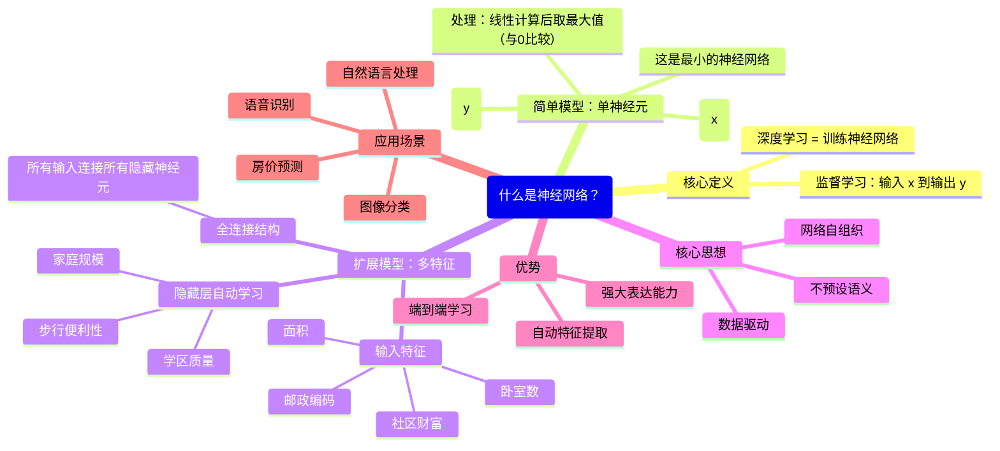

---

### 一、课程开篇：深度学习与神经网络的关系

>  **“深度学习” = 训练神经网络（尤其是非常大的神经网络）**

- 神经网络是深度学习的核心模型。
- 本节目标：建立对神经网络的**直观理解**，而非数学推导。

---

### 二、从一个简单例子开始：房价预测（Housing Price Prediction）

#### 1. 问题设定

- 已知：6套房屋的 **面积（x）**  和 **价格（y）**
- 目标：学习一个函数 \( f(x) \rightarrow y \)，用于预测新房子的价格

#### 2. 传统方法 vs 神经网络思路

|方法|描述|缺陷|
| ------| ----------------------------------------------------------| -------------------------|
|**线性回归**|拟合一条直线：\( y = w x + b \)|可能预测出**负价格**（不合理）|
|**改进方案**|将函数在 y=0 处截断：<br /> \( y = \max(0, w x + b) \)|更符合现实（价格 ≥ 0）|

> ✅ 这个“截断线性函数”就是 **ReLU（Rectified Linear Unit）激活函数**！

---

### 三、最简单的神经网络：单个神经元

```text
输入 x（面积） → [神经元] → 输出 y（价格）
```

- **神经元做了什么？**

  1. 接收输入 x
  2. 计算线性组合：\( z = w x + b \)
  3. 应用 ReLU 激活：\( a = \max(0, z) \)
  4. 输出预测值 y

> 🔑 **关键洞见**：这个单神经元模型本身就是一个**最简神经网络**！

---

### 四、构建更大的神经网络：多特征输入

#### 1. 更真实的房价影响因素

　　除了面积，还考虑：

- 卧室数量（# Bedrooms）
- 邮政编码（Zip Code）→ 反映 **步行便利性（Walkability）**
- 社区财富水平（Wealth）→ 反映 **学区质量（School Quality）**

#### 2. 神经网络如何“思考”？

- **隐藏层神经元** 自动学习中间抽象概念：

  - 某神经元 ≈ “家庭规模”（由面积 + 卧室数决定）
  - 某神经元 ≈ “生活便利度”（由邮编 + 财富决定）
  - 某神经元 ≈ “教育价值”（由邮编 + 财富决定）

> 💡 **重要原则**：  
> **不要人为指定每个神经元的含义！**   
> 而是把**所有输入特征**都提供给**每个隐藏神经元**，让网络自己决定如何组合。

#### 3. 全连接结构（Dense / Fully Connected）

- 输入层（4个特征） → 隐藏层（多个神经元）
- **每个输入都连接到每个隐藏神经元**
- 这种结构赋予网络强大的**函数拟合能力**

---

### 五、神经网络的核心优势

|优势|说明|
| ------| -----------------------------------------------------------------|
|✅ **端到端学习**|只需提供 (x, y) 训练数据，网络自动学习中间表示|
|✅ **自动特征工程**|无需人工设计“家庭规模”等高级特征|
|✅ **通用函数逼近器**|给定足够数据，可逼近任意复杂函数 \( f: x \rightarrow y \)|
|✅ **适用于监督学习**|图像识别、语音转文本、房价预测等典型场景|

---

### 六、关键术语速记

|术语|中文|说明|
| -----------------| --------------| -----------------------------------------|
|Neuron|神经元|基本计算单元|
|ReLU|修正线性单元|\( \text{ReLU}(z) = \max(0, z) \)|
|Input Layer|输入层|接收原始特征（如面积、卧室数）|
|Hidden Layer|隐藏层|自动学习特征表示的中间层|
|Output Layer|输出层|产生最终预测（如房价）|
|Fully Connected|全连接|每层神经元与下一层全部连接|

---

### 七、中文思维导图（脑图）



---

### 八、学习建议

1. **理解 ReLU 的作用**：解决负输出问题，引入非线性。
2. **接受“黑箱”初期状态**：不必强求解释每个神经元含义。
3. **动手实践**：用 TensorFlow/Keras 构建一个房价预测小网络。
4. **后续重点**：损失函数、梯度下降、反向传播——这些是训练网络的引擎。

---

　　✅ **总结一句话**：

> **神经网络是一个由大量简单计算单元（神经元）组成的系统，通过数据自动学习从输入到输出的复杂映射关系，而 ReLU 和全连接结构是其强大表达能力的基础。**

---

　　‍
