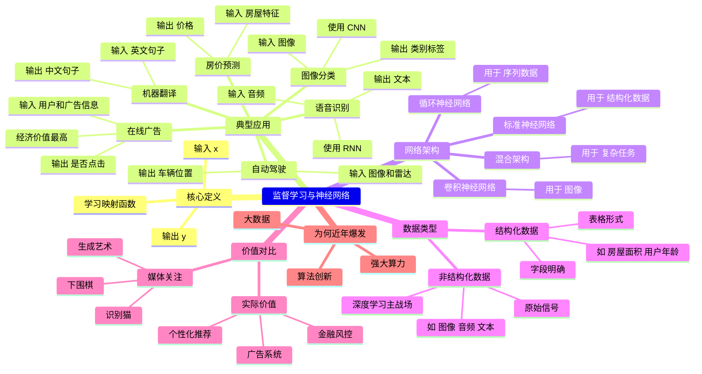

### 🎯 核心观点

> **迄今为止，神经网络创造的绝大部分经济价值，都来自「监督学习」（Supervised Learning）。**

---

## 一、什么是监督学习？

- ​**定义**：给定输入 ( x )，学习一个函数映射到输出 ( y )。

  - 输入 ( x )：特征（如房屋面积、用户年龄、图像像素等）
  - 输出 ( y )：目标标签（如房价、是否点击广告、物体类别等）
- ​**关键思想**：通过大量带标签的数据（(x, y) 对）训练模型，使其能对新输入做出准确预测。

---

## 二、监督学习的经典应用案例

|应用领域|输入 (x)|输出 (y)|经济/技术价值|
| ----------| ----------------------------| ------------------------------| ----------------------------------|
|**房价预测**|房屋特征（面积、卧室数等）|价格|结构化数据典型应用|
|**在线广告点击率预测**|用户信息 + 广告信息|是否点击（0/1）|**最赚钱的深度学习应用之一**|
|**图像分类（计算机视觉）**|图像（像素）|类别标签（如“猫”、“车”）|推动CV革命，用于照片标签、安防等|
|**语音识别**|音频片段|文本转录|智能助手、字幕生成等|
|**机器翻译**|英文句子|中文句子|跨语言沟通自动化|
|**自动驾驶**|前方图像 + 雷达数据|其他车辆位置/轨迹|多模态融合的关键组件|

> 💡 关键洞察：**成功**  **=**  **正确定义 (x) 和 (y) + 将监督学习嵌入更大系统（如自动驾驶）**

---

## 三、不同任务对应不同神经网络架构

|数据类型|网络架构|缩写|适用场景|
| ----------| ------------------| -------------------| -----------------------|
|**通用/结构化数据**|标准前馈神经网络|MLP（多层感知机）|房价预测、广告点击|
|**图像数据**|卷积神经网络|CNN|图像分类、目标检测|
|**序列数据（时间相关）**|循环神经网络|RNN / LSTM / GRU|语音、文本、时间序列|
|**多模态复杂任务**|混合/定制架构|—|自动驾驶（图像+雷达）|

> ✅ ​**CNN**​：擅长提取局部空间特征（如边缘、纹理）  
> ✅ ​**RNN**：擅长处理顺序依赖（如“昨天”影响“今天”的语义）

---

## 四、结构化数据 vs. 非结构化数据

|类型|定义|示例|特点|
| ------| --------------------------| ----------------------------------------------------| ------------------------------------------|
|**结构化数据**|表格形式，每列有明确含义|房屋数据库（面积、卧室数）、用户画像（年龄、性别）|易于传统模型处理，但神经网络也能提升精度|
|**非结构化数据**|无固定格式，原始信号|图像、音频、文本|人类天生擅长理解，**神经网络突破最大领域**|

> 🔥 ​**深度学习的最大突破**：让计算机终于能高效处理非结构化数据（图像/语音/文本），开启AI新时代。

---

## 五、媒体关注 vs. 实际价值

- ​**媒体更爱报道**​：识别猫、下围棋、生成艺术 → 因为**直观、有趣、有“人性共鸣”**
- ​**实际经济价值更多来自**：

  - 广告推荐系统
  - 金融风控
  - 电商个性化推荐
  - 企业数据库智能分析

> 📌 ​**提醒**​：不要只追逐“酷炫”应用，​**结构化数据中的监督学习同样极具商业价值**。

---

## 六、为什么现在才爆发？（预告）

> 虽然神经网络理论几十年前就存在，但直到近年才真正“起飞”。  
> 下一讲将探讨三大驱动力：
>
> 1. ​**大数据**（海量标注数据）
> 2. ​**算力提升**（GPU/TPU）
> 3. ​**算法改进**（如ReLU、BatchNorm、残差连接等）

---

## 🧠 思维导图（脑图）大纲（中文）

---

　　‍
