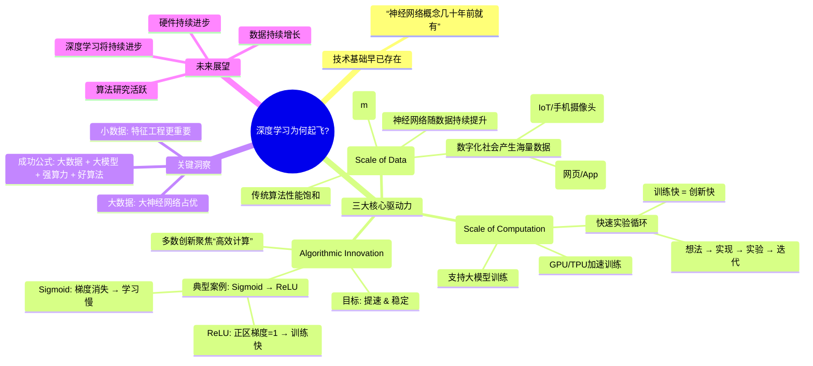

## 📌 核心观点总结

### 1. **技术基础早已存在**

- 深度学习的核心思想（如神经网络）早在几十年前就已提出。
- 但直到最近十年才大规模成功应用。

### 2. **三大驱动力推动深度学习崛起**

#### ✅ 驱动因素一：**数据规模（Scale of Data）**

- 数字化社会带来海量数据：

  - 用户行为（网页、App、搜索等）
  - 传感器数据（手机摄像头、IoT设备、加速度计等）
- 传统机器学习算法（如SVM、逻辑回归）在小数据下表现良好，但在大数据下性能趋于饱和。
- ​**神经网络的优势**：随着数据量增加，大模型性能持续提升，无明显平台期。

> 📊 图表说明：
>
> - X轴：训练数据量（标注数据，记为 ​*m*）
> - Y轴：模型性能（如准确率）
> - 小/中/大神经网络：性能随规模增大而提升
> - 传统算法：早期上升快，后期停滞

#### ✅ 驱动因素二：**计算能力（Scale of Computation）**

- GPU、TPU 等专用硬件加速训练
- 大模型训练成为可能
- ​**快速实验循环**：

  - 快速训练 → 快速验证想法 → 快速迭代优化
  - 若训练需数周/月，创新效率极低；若只需几分钟/小时，则可高频试错

#### ✅ 驱动因素三：**算法创新（Algorithmic Innovations）**

- 创新目标：**提升训练速度与稳定性**
- 典型例子：**激活函数从 Sigmoid → ReLU（Rectified Linear Unit）**

  - Sigmoid 问题：梯度在两端趋近于0 → 梯度消失 → 学习缓慢
  - ReLU 优势：正区间梯度恒为1 → 梯度稳定 → 训练更快
- 其他算法改进也多围绕“让大模型跑得更快、更稳”

---

### 3. **关键结论**

- **深度学习的成功**  **=**  **大数据 + 大模型 + 强算力 + 好算法**
- 在**小数据场景**下，特征工程和算法选择更重要，神经网络未必占优
- 在**大数据场景**下，大型神经网络显著优于传统方法
- 未来趋势依然乐观：

  - 数据持续增长
  - 硬件持续进步（GPU/TPU/光子芯片等）
  - 算法研究活跃，持续突破

---

## 🧠 学习建议（来自吴恩达）

- 当被问“为什么深度学习现在火了？”时，请画出上述“性能 vs 数据量”曲线图。
- 在自己的组织中寻找**具备大量标注数据**的应用场景，这是深度学习发挥优势的关键前提。

---

## 🌐 Mermaid 脑图

---

## ✅ 总结一句话：

> **深度学习的爆发不是因为新理论，而是因为“数据够多、算力够强、算法够快”——三者共同解锁了神经网络的真正潜力。**

　　‍
