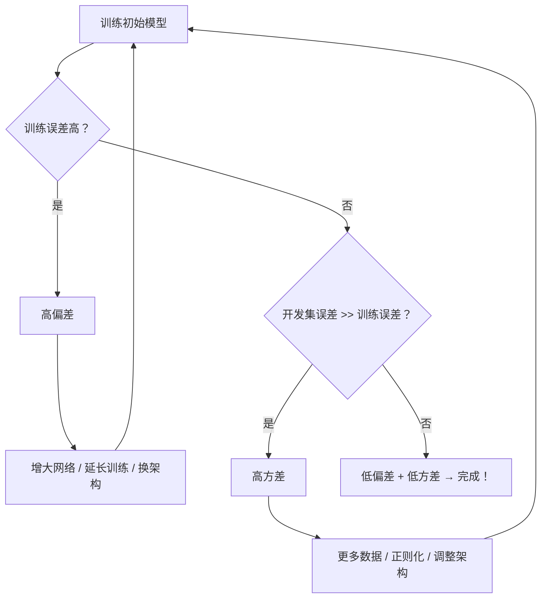

## 一、核心目标

　　系统性地诊断并改进神经网络模型的性能，主要围绕两个关键问题：

- **高偏差（High Bias）**  → 欠拟合（Underfitting）
- **高方差（High Variance）**  → 过拟合（Overfitting）

　　通过分析 **训练误差（Training Error）**  和 **开发集误差（Dev Error）** ，判断模型当前处于哪种状态，并采取针对性措施。

---

## 二、诊断流程

### 步骤 1：检查是否高偏差（欠拟合）

- **判断依据**：训练误差是否过高？

  - 若训练误差远高于可接受水平（例如人类水平或贝叶斯误差），说明存在**高偏差**。
- **解决方法**（优先尝试）：

  1. **增大网络容量**：

     - 增加隐藏层数（更深网络）
     - 增加每层隐藏单元数（更宽网络）
     - > 💡 “只要问题本身是可解的（如人类能完成），足够大的网络通常能拟合训练数据。”
       >
  2. **延长训练时间** 或 使用更先进的优化算法（如 Adam、RMSProp 等）
  3. （可选）尝试更适合任务的**神经网络架构**（如 CNN、Transformer 等）— 效果不确定，需实验验证。

> ✅ **关键原则**：在现代深度学习中，**增大网络几乎总能降低偏差**，且只要配合正则化，不会显著增加方差。

---

### 步骤 2：检查是否高方差（过拟合）

- **前提**：训练误差已较低（即偏差已控制）
- **判断依据**：开发集误差是否显著高于训练误差？

  - 若是，则存在**高方差**。
- **解决方法**：

  1. **获取更多训练数据**（最有效，但有时不可行）

     - 更多数据 → 更好泛化 → 降低方差
  2. **正则化（Regularization）** （下一讲重点）

     - L2 正则化（权重衰减）：

       $$
       J_{\text{reg}} = J + \frac{\lambda}{2m} \sum_{l=1}^{L} \sum_{i,j} (W^{[l]}_{ij})^2
       $$
     - Dropout、数据增强（Data Augmentation）等
  3. （可选）调整网络架构以提升泛化能力（如简化结构、使用 BatchNorm 等）

> ✅ **关键原则**：**更多数据几乎总能降低方差**，且对偏差影响很小。

---

## 三、现代深度学习 vs 传统机器学习：偏差-方差权衡的演变

|时期|特点|工具限制|
| ------| ------------------------------------------------| -------------------------------------|
|**传统 ML 时代**|存在明显的 **偏差-方差权衡（Bias-Variance Tradeoff）**  → 改善一方常损害另一方|模型容量有限，无法独立控制偏差/方差|
|**现代深度学习 + 大数据时代**|**可独立降低偏差或方差**： - 更大网络 → ↓偏差 - 更多数据 → ↓方差|只要计算资源允许，可分别优化|

> 🌟 **重要结论**：  
> 在正则化得当的前提下，**训练一个更大的网络几乎从不伤害性能**，主要代价只是**计算时间**。

---

## 四、系统性改进流程（算法配方）

> 🔁 **迭代过程**：不断循环“诊断 → 干预 → 再评估”，直到同时满足：
>
> - 训练误差 ≈ 贝叶斯误差（或人类水平）→ **低偏差**
> - 开发集误差 ≈ 训练误差 → **低方差**

---

## 五、关键要点提炼

1. **先解决偏差，再解决方差**  
   → 必须先能拟合训练数据，再谈泛化。
2. **不要盲目收集数据**  
   → 如果模型连训练集都拟合不好（高偏差），更多数据**无效**。
3. **正则化是控制方差的核心工具**  
   → 下一讲将深入讲解 L2、Dropout 等技术。
4.  **“大网络 + 正则化” 是现代 DL 黄金组合**  
   → 网络越大，表达能力越强；正则化防止过拟合。
5. **人类表现可作为贝叶斯误差的近似**  
   → 若人类能轻松完成任务（如图像识别），则理论上模型也能做到低偏差。

---

## 六、后续学习预告

- **正则化技术详解**（L2、Dropout、Early Stopping、Data Augmentation）
- 如何选择合适的正则化强度（超参数 $\lambda$）
- 正则化对偏差的轻微影响及如何补偿
