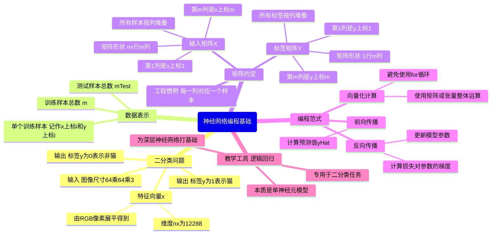

---

### 一、课程概述

　　本节课是深度学习入门系列的第一部分，重点介绍**神经网络编程的基本范式**，并通过**逻辑回归（Logistic Regression）**  这一简单但核心的模型，讲解以下关键思想：

- **向量化（Vectorization）** ：避免使用显式的 `for` 循环遍历训练样本，而是通过矩阵运算一次性处理整个训练集。
- **前向传播（Forward Propagation）与反向传播（Backward Propagation）** ：神经网络计算的两个基本阶段。
- **数据表示与符号约定（Notation）** ：为后续构建更复杂的神经网络打下基础。

> 💡 即使你已经熟悉逻辑回归，本节仍会引入新的工程视角和实现技巧。

---

### 二、核心内容详解

#### 1. 二分类问题设定（Binary Classification Problem）

- **任务目标**：给定一张图像，判断是否为“猫”。

  - 若是猫 → 输出标签 $y = 1$
  - 若不是猫 → 输出标签 $y = 0$
- **图像在计算机中的表示**：

  - 彩色图像 = 3 个通道（Red, Green, Blue）
  - 假设图像尺寸为 $64 \times 64$ 像素
  - 则每个通道是一个 $64 \times 64$ 的矩阵
  - 总像素数 = $64 \times 64 \times 3 = 12,\!288$
- **特征向量** **$\mathbf{x}$** **的构造**：

  - 将所有 RGB 像素值“展平”（flatten / unroll）成一个列向量
  - 得到输入特征向量 $\mathbf{x} \in \mathbb{R}^{12288}$
  - 记作：$n_x = 12288$，有时简写为 $n$

> ✅ 目标：学习一个函数 $f: \mathbf{x} \rightarrow y \in \{0, 1\}$

---

#### 2. 数据集与符号约定（Notation）

|符号|含义|
| ------| -----------------------------------------------------|
|$(x^{(i)}, y^{(i)})$|第 $i$ 个训练样本（注意上标不是幂）|
|$m$|训练样本总数（有时写作 $m_{\text{train}}$）|
|$m_{\text{test}}$|测试集样本数量|
|$\mathbf{X}$|所有训练输入组成的矩阵，维度为 $n_x \times m$<br />每一列是一个样本：$\mathbf{X} = [x^{(1)}\ x^{(2)}\ \cdots\ x^{(m)}]$|
|$\mathbf{Y}$|所有标签组成的矩阵，维度为 $1 \times m$<br />$\mathbf{Y} = [y^{(1)}\ y^{(2)}\ \cdots\ y^{(m)}]$|

> 🔑 关键工程实践：**将不同样本的数据按列堆叠（column-wise stacking）** ，便于向量化计算。

- 在 Python 中：

  ```python
  X.shape  # (nx, m)
  Y.shape  # (1, m)
  ```

> ⚠️ 注意：有些教材按行堆叠（$x^{(i)T}$ 作为行），但本课程采用**列堆叠**，更适配深度学习框架（如 NumPy、TensorFlow）。

---

#### 3. 为什么用逻辑回归教学？

- 逻辑回归是**最简单的神经网络（单神经元）**
- 它天然支持**二分类**
- 可清晰展示：

  - 损失函数（Loss Function）
  - 梯度下降（Gradient Descent）
  - 前向/反向传播流程
- 为后续多层神经网络奠定基础

---

#### 4. 核心编程思想预告

- **避免 for 循环**：利用 NumPy 等库进行**向量化运算**，大幅提升效率。
- **计算分两步**：

  1. **前向传播（Forward Prop）** ：计算预测值 $\hat{y}$
  2. **反向传播（Backward Prop）** ：计算梯度，更新参数
- 这种模式将在深层网络中反复出现。

---

### 三、学习建议

- 动手实现逻辑回归的向量化版本（不用 for 循环）
- 熟记符号约定（$\mathbf{X}, \mathbf{Y}, m, n_x$）
- 理解“列堆叠”为何更适合 GPU/并行计算
- 下一节将正式推导逻辑回归的数学与代码

---

### 四、Mermaid 脑图



---

### 五、总结

　　本节课虽以“逻辑回归”为载体，实则传授了**现代深度学习工程的核心范式**：  
**向量化 + 列堆叠数据 + 前/后向传播分离**。  
掌握这些，就等于拿到了进入神经网络世界的第一把钥匙 🔑。

　　建议结合代码练习（如用 NumPy 实现无循环的逻辑回归），加深理解。
