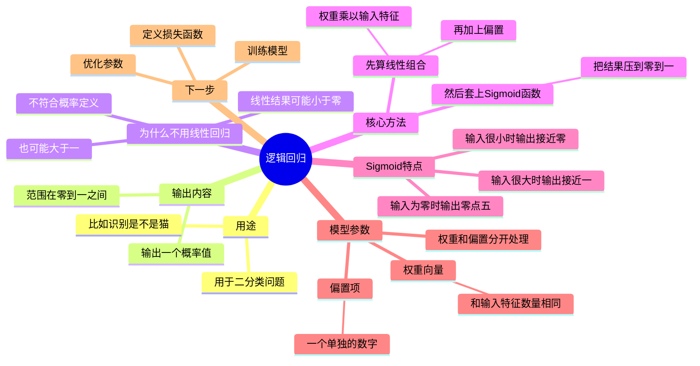

## 一、课程内容详解

### 1. 逻辑回归（Logistic Regression）简介

- **适用场景**：监督学习中的**二分类问题**，即标签 $y \in \{0, 1\}$。
- **目标**：给定输入特征向量 $\mathbf{x} \in \mathbb{R}^{n_x}$，模型输出预测值 $\hat{y}$，表示：

  $$
  \hat{y} = P(y = 1 \mid \mathbf{x})
  $$

  即在给定输入 $\mathbf{x}$ 的条件下，$y = 1$ 的概率。

### 2. 为何不能直接使用线性回归？

- 若令 $\hat{y} = \mathbf{w}^\top \mathbf{x} + b$，则：

  - 输出可能 **小于 0** 或 **大于 1**；
  - 不符合概率定义（概率必须在 $[0, 1]$ 区间内）。

### 3. 逻辑回归的核心：Sigmoid 函数

- 引入 **Sigmoid 激活函数**：

  $$
  \sigma(z) = \frac{1}{1 + e^{-z}}
  $$
- 定义 $z = \mathbf{w}^\top \mathbf{x} + b$，则最终预测为：

  $$
  \hat{y} = \sigma(\mathbf{w}^\top \mathbf{x} + b)
  $$

#### Sigmoid 函数性质：

- 当 $z \to +\infty$，$\sigma(z) \to 1$
- 当 $z \to -\infty$，$\sigma(z) \to 0$
- 当 $z = 0$，$\sigma(0) = 0.5$

### 4. 参数说明

- **权重向量**：$\mathbf{w} \in \mathbb{R}^{n_x}$
- **偏置项**：$b \in \mathbb{R}$
- 在本课程中，**不采用将** **$b$** **合并进** **$\mathbf{w}$** **的方式**（即不引入 $x_0 = 1$ 的技巧），而是将 $\mathbf{w}$ 与 $b$ 作为独立参数处理[ty-reference](5)。

### 5. 学习目标

- 通过训练数据学习最优的 $\mathbf{w}$ 和 $b$，使得 $\hat{y}$ 尽可能接近真实标签 $y$。
- 为此，需要定义一个**损失函数（Loss Function）**  和**成本函数（Cost Function）** （将在后续视频讲解）。

---

## 二、课程核心要点总结

|要点|内容|
| ------| --------------------------------------|
|**任务类型**|二分类（Binary Classification）|
|**输入**|特征向量 $\mathbf{x} \in \mathbb{R}^{n_x}$|
|**输出**|预测概率 $\hat{y} = P(y=1 \mid \mathbf{x}) \in [0,1]$|
|**模型结构**|$\hat{y} = \sigma(\mathbf{w}^\top \mathbf{x} + b)$|
|**激活函数**|Sigmoid: $\sigma(z) = \dfrac{1}{1 + e^{-z}}$|
|**参数形式**|$\mathbf{w}$ 与 $b$ 分离，不合并|
|**后续步骤**|定义损失函数 → 优化参数 → 训练模型|

---

## 四、补充说明

- 逻辑回归虽然名为“回归”，但本质是**最简单的神经网络模型**，仅包含一个神经元（带 Sigmoid 激活）[ty-reference](6)。
- 它是构建更复杂神经网络（如多层感知机、深度网络）的基础单元[ty-reference](1)。
- 在实际深度学习框架（如 PyTorch、TensorFlow）中，逻辑回归常作为分类任务的入门案例[ty-reference](5)。

---

### 🎯 它是干啥的？

- **解决二分类问题**：比如判断一张图是不是猫（是/不是）、邮件是不是垃圾邮件（是/否）。
- **输出一个概率**：不是直接说“是”或“不是”，而是告诉你“有 85% 的可能是猫”。

---

### ❌ 为啥不能用线性回归？

　　想象一下：

- 线性回归会说：“这张图是猫的概率是 **1.5**” 😱
- 或者：“概率是  **-0.3**”？？？这根本说不通！

　　✅ 概率必须在 **0 到 1 之间**！所以需要一个“聪明”的函数来帮忙。

---

### ✨ 核心武器：Sigmoid 函数

- 它长得像一条平滑的“S”曲线。
- 特点：

  - 输入很大 → 输出接近 **1**
  - 输入很小（负得很多）→ 输出接近 **0**
  - 输入是 0 → 输出正好是 **0.5**

　　👉 这样就能把任意数字“压缩”到 0～1 之间，完美表示概率！

---

### 🧠 模型怎么算预测结果？

1. 先计算一个中间值：  
    **权重 × 输入特征 + 偏置**  
    （专业点叫：线性组合）
2. 把这个值丢进 Sigmoid 函数，得到最终预测概率！

> 💡 举个例子：  
> 输入是一张图片 → 提取 1000 个特征 → 乘上对应的 1000 个权重 → 加上偏置 → 过 Sigmoid → 输出“是猫的概率”

---

### 🔧 参数长什么样？

- **权重（weights）** ：和输入特征一样多，每个特征都有一个“重要程度”。
- **偏置（bias）** ：一个单独的数，用来微调结果。
- ⚠️ 注意：本课程里，**权重和偏置是分开存的**，不搞“合并技巧”，更清晰！

---

### 📚 接下来要学什么？

- 如何判断模型好不好？→ **定义损失函数（比如交叉熵）**
- 怎么让模型变聪明？→ **用梯度下降调整参数**
- 最终目标：让预测概率越来越接近真实标签！

---

## 🧩 超兼容中文脑图

---
