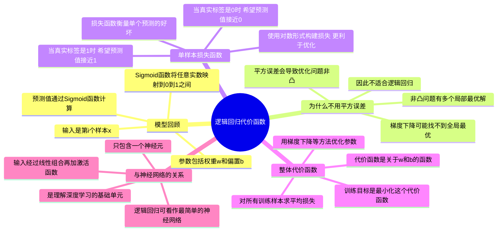

### 1. 回顾：逻辑回归模型

- 逻辑回归用于二分类问题。
- 对于输入样本 $x^{(i)}$，模型预测输出为：

  $$
  \hat{y}^{(i)} = \sigma(w^\top x^{(i)} + b)
  $$

  其中 $\sigma(z) = \frac{1}{1 + e^{-z}}$ 是 **Sigmoid 函数**。
- $w$ 和 $b$ 是需要学习的参数。

> 注：上标 $(i)$ 表示第 $i$ 个训练样本。

---

### 2. 为什么不能用平方误差作为损失函数？

- 直觉上可能想用平方误差：$L(\hat{y}, y) = \frac{1}{2}(\hat{y} - y)^2$
- **但问题在于**：当把这个损失用于逻辑回归时，整体代价函数会变成**非凸函数（non-convex）** 。
- 非凸函数意味着存在多个局部极小值，梯度下降可能无法找到全局最优解。
- 因此，**不推荐**在逻辑回归中使用平方误差。

---

### 3. 逻辑回归使用的损失函数（Loss Function）

- 对单个样本 $(x^{(i)}, y^{(i)})$，定义损失函数为：

  $$
  L(\hat{y}^{(i)}, y^{(i)}) = -\left[ y^{(i)} \log(\hat{y}^{(i)}) + (1 - y^{(i)}) \log(1 - \hat{y}^{(i)}) \right]
  $$
- 这个函数称为 **对数损失（Log Loss）**  或 **交叉熵损失（Cross-Entropy Loss）** 。

#### 直观理解：

- **当** **$y = 1$** 时，损失简化为 $-\log(\hat{y})$：

  - 要使损失小 → $\hat{y}$ 要接近 1。
- **当** **$y = 0$** 时，损失简化为 $-\log(1 - \hat{y})$：

  - 要使损失小 → $\hat{y}$ 要接近 0。
- 完美符合二分类目标！

---

### 4. 代价函数（Cost Function）

- 损失函数衡量**单个样本**的误差。
- 代价函数衡量**整个训练集**的平均误差：

  $$
  J(w, b) = \frac{1}{m} \sum_{i=1}^{m} L(\hat{y}^{(i)}, y^{(i)})
  $$

  展开后为：

  $$
  J(w, b) = -\frac{1}{m} \sum_{i=1}^{m} \left[ y^{(i)} \log(\hat{y}^{(i)}) + (1 - y^{(i)}) \log(1 - \hat{y}^{(i)}) \right]
  $$
- 训练目标：**找到** **$w$** **和** **$b$**​ **，使得** **$J(w, b)$** **最小**。

---

### 5. 逻辑回归与神经网络的关系

- 逻辑回归可看作**只有一个神经元的神经网络**。
- 输入层 → 单个计算单元（带 Sigmoid 激活）→ 输出。
- 这是理解更复杂神经网络的起点。

---

## 二、课程总结

|主题|内容|
| ------| --------------------------------------|
|**模型**|$\hat{y} = \sigma(w^\top x + b)$|
|**损失函数（单样本）**|$L = -[y \log(\hat{y}) + (1 - y)\log(1 - \hat{y})]$|
|**代价函数（全体样本）**|$J(w, b) = \frac{1}{m} \sum L^{(i)}$|
|**为何不用平方误差？**|导致非凸优化问题，梯度下降效果差|
|**为何用对数损失？**|凸函数，有唯一全局最优，梯度下降高效|
|**与神经网络关系**|逻辑回归 = 单神经元网络|

---

## 三、脑图

---

## 四、学习建议

1. **动手推导**：自己写出 $J(w, b)$ 对 $w$ 和 $b$ 的偏导数（后续课程会讲梯度下降）。
2. **可视化理解**：画出 $-\log(\hat{y})$ 和 $-\log(1 - \hat{y})$ 的图像，感受损失如何惩罚错误预测。
3. **编程实现**：用 Python/Numpy 实现逻辑回归的前向传播和代价函数计算。

---
