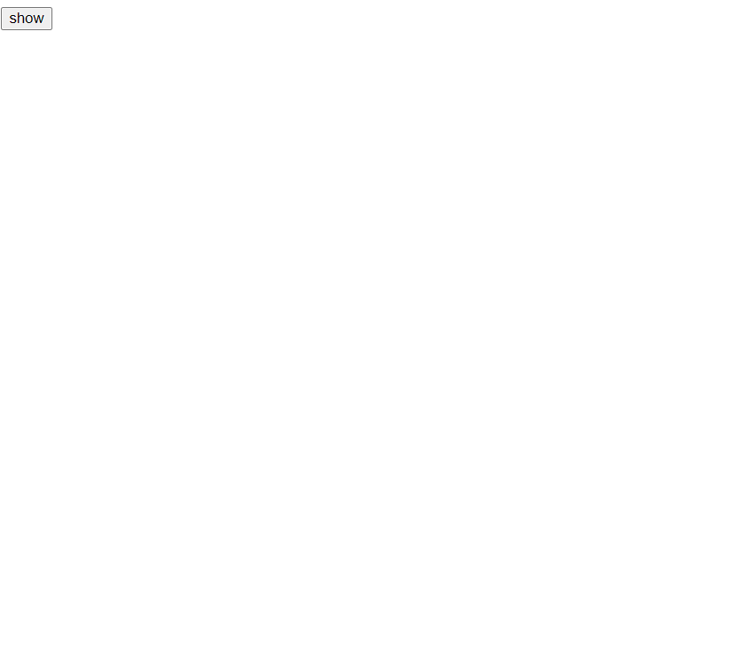
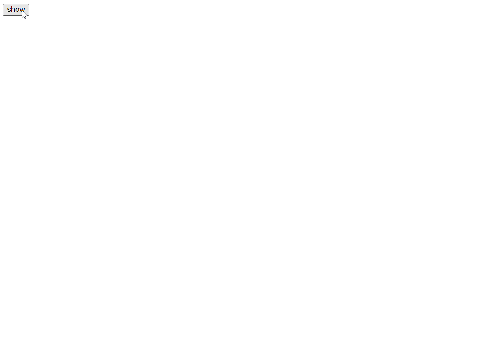
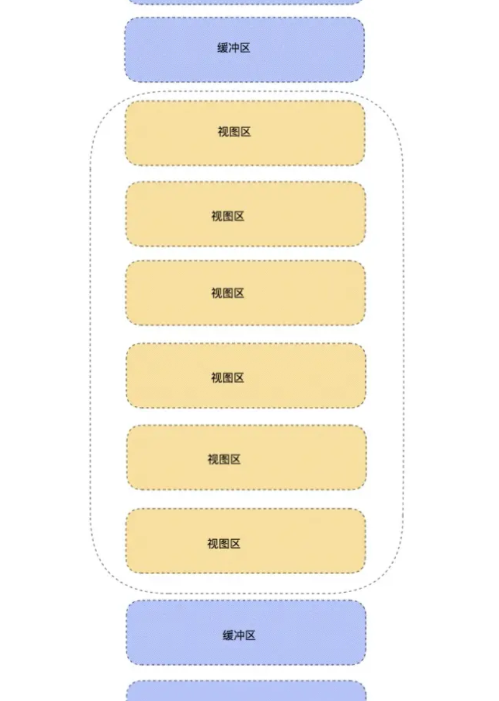
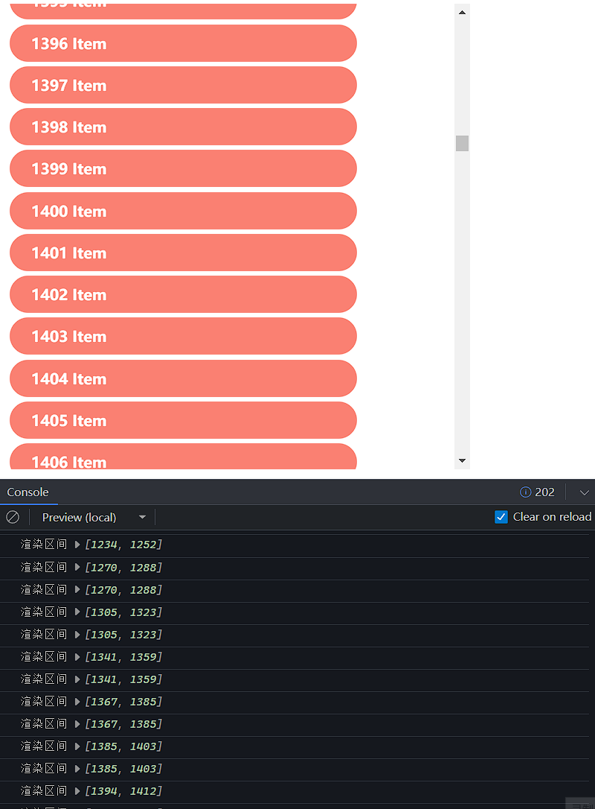

### 对于项目中大量数据通常存在两种情况：

- 第一种就是数据可视化，比如像热力图，地图，大量的数据点位的情况。
- 第二种情况是长列表渲染。

### 1.时间分片

不使用分片

```CSS
.circle {
  position: absolute;
  width: 10px;
  height: 10px;
  border-radius: 50%;
}

.box {
  width: 100vm;
  height: 100vh;
}

```

```javascript
import { useEffect, useMemo, useRef, useState } from "react";
import "./index.css";
/* 获取随机颜色 */
function getColor() {
  const r = Math.floor(Math.random() * 255);
  const g = Math.floor(Math.random() * 255);
  const b = Math.floor(Math.random() * 255);
  return "rgba(" + r + "," + g + "," + b + ",0.8)";
}
/* 获取随机位置 */
function getPostion(position) {
  const { width, height } = position;
  return {
    left: Math.ceil(Math.random() * width) + "px",
    top: Math.ceil(Math.random() * height) + "px",
  };
}

function Circle({ position }) {
  const style = useMemo(() => {
    return {
      background: getColor(),
      ...getPostion(position),
    };
  }, [position]);
  return <div style={style} className="circle"></div>;
}

function Box() {
  const [state, setState] = useState({
    dataList: [],
    renderList: [],
    position: { width: 0, height: 0 },
  });
  const boxRef = useRef(null);

  useEffect(() => {
    if (!boxRef.current) {
      return;
    }
    const { offsetHeight, offsetWidth } = boxRef.current;
    const originList = Array.from({ length: 20000 });
    setState({
      position: { height: offsetHeight, width: offsetWidth },
      dataList: originList,
      renderList: originList,
    });
  }, []);
  return (
    <div className="box" ref={boxRef}>
      {state.renderList.map((item, index) => (
        <Circle position={state.position} key={item + index + ""} />
      ))}
    </div>
  );
}

export default function Index() {
  const [show, setShow] = useState(false);

  return (
    <div
      style={{
        width: "100%",
        height: "100%",
      }}
    >
      <button onClick={() => setShow(true)}>show</button>
      {show && <Box />}
    </div>
  );
}
```

效果：

​​

#### 时间分片

```js
// 修改box文件
class Box extends React.Component {
  state = {
    dataList: [], //数据源列表
    renderList: [], //渲染列表
    position: { width: 0, height: 0 }, // 位置信息
    chunk: 500, // 每次渲染数量
  };
  box = React.createRef<HTMLDivElement>();
  componentDidMount() {
    const { offsetHeight, offsetWidth } = this.box.current;
    const originList = Array.from({ length: 20000 });
    /* 计算需要渲染此次数*/
    const times = Math.ceil(
      originList.length / this.state.chunk
    );
    let index = 1;
    this.setState(
      {
        dataList: originList,
        position: { height: offsetHeight, width: offsetWidth },
      },
      () => {
        this.toRenderList(index, times);
      }
    );
  }
  toRenderList = (index, times) => {
    if (index > times) return; /* 如果渲染完成，那么退出 */
    const { renderList } = this.state;
    /* 通过缓存element把所有渲染完成的list缓存下来，下一次更新，直接跳过渲染 */
    renderList.push(this.renderNewList(index));
    this.setState({
      renderList,
    });
    /* 用 requestIdleCallback 代替 setTimeout 浏览器空闲执行下一批渲染 */
    requestIdleCallback(() => {
      this.toRenderList(++index, times);
    });
  };
  renderNewList(index) {
    /* 得到最新的渲染列表 */
    const { dataList, position, chunk } = this.state;
    const list = dataList.slice((index - 1) * chunk, index * chunk);
    return (
      <React.Fragment key={index}>
        {list.map((item, index) => (
          <Circle key={index} position={position} />
        ))}
      </React.Fragment>
    );
  }

  render() {
    return (
      <div className="box" ref={this.box}>
        {this.state.renderList}
      </div>
    );
  }
}
```

效果：

​​

### 虚拟列表

​​

- 视图区：视图区就是能够直观看到的列表区，此时的元素都是真实的 DOM 元素。
- 缓冲区：缓冲区是为了防止用户上滑或者下滑过程中，出现白屏等效果。（缓冲区和视图区为渲染真实的 DOM ）
- 虚拟区：对于用户看不见的区域（除了缓冲区），剩下的区域，不需要渲染真实的 DOM 元素。虚拟列表就是通过这个方式来减少页面上 DOM 元素的数量。

```js
export default function VirtualList() {
  const [dataList, setDataList] = useState([]);
  /* 截取缓冲区 + 视图区索引 */
  const [position, setPosition] = useState([0, 0]);

  const scroll = useRef(null);
  const box = useRef(null);
  /* 用于移动视图区域，形成滑动效果。 */
  const context = useRef(null);

  const scrollInfo = useRef({
    height: 500 /* 容器高度 */,
    bufferCount: 8 /* 缓冲区个数 */,
    itemHeight: 60 /* 每一个item高度 */,
    renderCount: 0 /* 渲染区个数 */,
  });

  useEffect(() => {
    if (!box.current) return;
    const height = box.current.offsetHeight;
    const { itemHeight, bufferCount } = scrollInfo.current;
    const renderCount = Math.ceil(height / itemHeight) + bufferCount;
    scrollInfo.current = { renderCount, height, bufferCount, itemHeight };
    const dataList = Array.from({ length: 5000 }).map((_, index) => index + 1);
    setDataList(dataList);
    setPosition([0, renderCount]);
  }, []);

  const handleScroll = () => {
    const { scrollTop } = scroll.current;
    const { itemHeight, renderCount } = scrollInfo.current;

    const currentOffset = scrollTop - (scrollTop % itemHeight);
    const start = Math.floor(scrollTop / itemHeight);
    context.current.style.transform = `translate3d(0, ${currentOffset}px, 0)`; /* 偏移，造成下滑效果 */
    const end = Math.floor(scrollTop / itemHeight + renderCount + 1);

    /* 如果render内容发生改变，那么截取  */
    if (end !== position[1] || start !== position[0]) {
      setPosition([start, end]);
    }
  };

  const { itemHeight, height } = scrollInfo.current;
  const [start, end] = position;
  /* 渲染区间 */
  const renderList = dataList.slice(start, end);
  console.log("渲染区间", position);
  return (
    <div className="list_box" ref={box}>
      <div
        className="scroll_box"
        style={{ height: height + "px" }}
        onScroll={handleScroll}
        ref={scroll}
      >
        <div
          className="scroll_hold"
          style={{ height: `${dataList.length * itemHeight}px` }}
        />
        <div className="context" ref={context}>
          {renderList.map((item, index) => (
            <div className="list" key={index}>
              {`${item} Item`}
            </div>
          ))}
        </div>
      </div>
    </div>
  );
}
```

```css
.list_box {
  width: 500px;
  height: 500px;
}
.list_box .scroll_box {
  width: 500px;
  position: relative;
  overflow-y: scroll;
}
.list {
  height: 40px;
  width: calc(100% - 50px);
  padding-left: 23px;
  margin: 5px;
  text-align: left;
  line-height: 40px;
  background-color: salmon;
  border-radius: 40px;
  color: white;
  font-weight: bolder;
}
.context {
  position: absolute;
  top: 0;
  width: 400px;
}
```

效果：

​

‍
