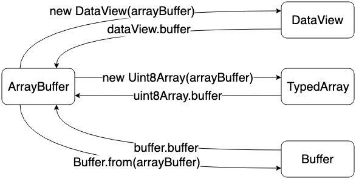
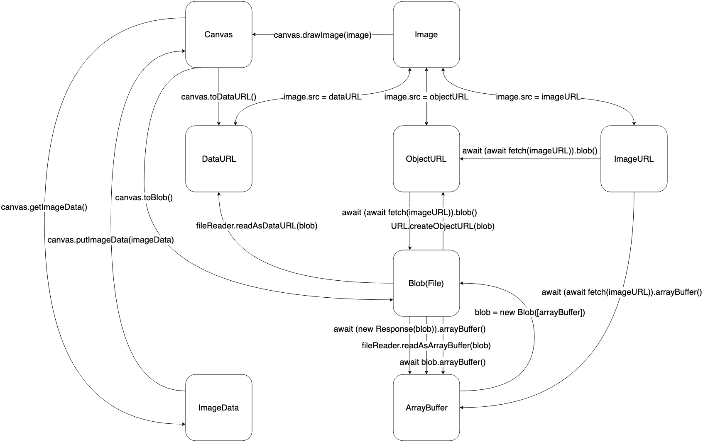

　　在做一个工具内截图的功能时发现的问题，Unit8Array 类型的数据转换成 blob 二进制数据然后上传到后端时出现错误。这里记录一下解决方法

### **​`Uint8Array`​**​ **和** **​`ImageData`​**​ **的关系**

* ​**​`Uint8Array`​**​ 是一个存储 8 位无符号整数的数组，常用于表示二进制数据（如图像的像素数据）。
* ​**​`ImageData`​**​ 是浏览器提供的一个专门用于表示图像数据的对象，通常用于 `<canvas>`​ 元素的图像操作。它的数据结构是一个包含像素数据的 `Uint8ClampedArray`​（类似于 `Uint8Array`​，但值会被限制在 0-255 之间）。

#### **为什么可以转换？**

* ​`ImageData`​ 的像素数据本质上是一个一维数组，每个像素由 4 个值（RGBA）表示，每个值是一个 8 位无符号整数（0-255）。
* 如果 `Uint8Array`​ 中的数据是按照 RGBA 顺序排列的，并且长度与图像的宽度和高度匹配，那么可以直接将其转换为 `ImageData`​。

#### **转换示例：**

```js
// 假设有一个 2x2 的图像，每个像素有 RGBA 四个通道
let width = 2;
let height = 2;
let pixelData = new Uint8Array([
    255, 0, 0, 255,   // 红色像素
    0, 255, 0, 255,   // 绿色像素
    0, 0, 255, 255,   // 蓝色像素
    255, 255, 255, 255 // 白色像素
]);

// 创建 ImageData 对象
let imageData = new ImageData(new Uint8ClampedArray(pixelData), width, height);

console.log(imageData);
```

### **​`Uint8Array`​**​ **和** **​`Blob`​**​ **的关系**

* ​**​`Blob`​**​ 是一种表示不可变二进制数据的对象，通常用于文件操作（如上传、下载）或存储任意类型的二进制数据。
* ​`Blob`​ 的数据可以是任意格式的二进制数据（如图片、音频、视频、文本等），而不仅仅是图像数据。

#### **为什么不能直接转换？**

* ​`Uint8Array`​ 只是一个存储 8 位无符号整数的数组，它本身没有描述数据的格式或类型（例如，是图像、音频还是其他数据）。
* 要将 `Uint8Array`​ 转换为 `Blob`​，需要明确指定数据的 MIME 类型（如 `image/png`​、`application/octet-stream`​ 等），以便 `Blob`​ 知道如何解释这些数据。

#### **如何转换为** **​`Blob`​**​ **？**

　　虽然不能直接转换，但可以通过指定 MIME 类型将 `Uint8Array`​ 包装成 `Blob`​：

```js
let uint8Array = new Uint8Array([72, 101, 108, 108, 111]); // "Hello" 的二进制数据
let blob = new Blob([uint8Array], { type: 'application/octet-stream' }); // 创建 Blob

console.log(blob);
```

### 3. **关键区别**

|特性|​`ImageData`​|​`Blob`​|
| ----| --------------------------| ----------------------------|
|**用途**|专门用于表示图像像素数据|用于表示任意类型的二进制数据|
|**数据结构**|必须是 RGBA 格式的像素数据|可以是任意格式的二进制数据|
|**MIME 类型**|不需要指定 MIME 类型|需要明确指定 MIME 类型|
|**浏览器支持**|主要用于 `<canvas>`​ 图像操作|用于文件操作（上传、下载等）|

### 图像的数据类型

### DOM

#### ``​

　　​[`&lt;img&gt;`](https://developer.mozilla.org/zh-CN/docs/Web/HTML/Element/img "``")​ 元素从 URL（Data URL，HTTP URL 或 Object URL）加载图像。

#### `<canvas>`​

　　​[`&lt;canvas&gt;`](https://developer.mozilla.org/zh-CN/docs/Web/HTML/Element/canvas "`<canvas>`")​ 元素通过 canvas API [`drawImage`](https://developer.mozilla.org/zh-CN/docs/Web/API/CanvasRenderingContext2D/drawImage "`drawImage`")​ 来获取 ``​ 元素上的图像数据。

### URL

#### Data URL

　　[Data URL](https://developer.mozilla.org/zh-CN/docs/Web/HTTP/Basics_of_HTTP/Data_URIs "Data URL") 带有 base64 编码的图像数据。可以从 Data URL 数据中解码出图像的二进制数据。Data URL 数据的大小比原始的二进制数据大一些。

#### HTTP URL

　　[HTTP URL](https://developer.mozilla.org/zh-CN/docs/Learn/Common_questions/What_is_a_URL "HTTP URL") 代表存储在服务器上的图像。HTTP URL 用于从服务器获取图像数据。

#### Object URL

　　[Object URL](https://developer.mozilla.org/zh-CN/docs/Web/API/URL/createObjectURL "Object URL") 用来代表存储在浏览器内存中的 `File`​ 或 `Blob`​ 对象。Object URL 可以由 `createObjectURL`​ API 来创建，并由 `revokeObjectURL`​ API 释放。

### 文件

#### `Blob`​

　　​[`Blob`](https://developer.mozilla.org/zh-CN/docs/Web/API/Blob "`Blob`")​ 是带有二进制数据的类文件对象。它包含一个只读的 `size`​ 属性和一个只读的 `type`​ 属性。你可以通过 `slice`​，`stream`​，`text`​ 等方法来读取二进制数据。

#### `File`​

　　一个 [`File`](https://developer.mozilla.org/zh-CN/docs/Web/API/File "`File`")​ 对象是一个特殊的 `Blob`​ 对象。除了 `Blob`​ 的属性和方法外，`File`​ 对象还包含 `lastModified`​，`name`​ 等属性。

#### ​`ImageData`​

　　一个 [`ImageData`](https://developer.mozilla.org/zh-CN/docs/Web/API/ImageData "`ImageData`")​ 对象是一个 JavaScript 对象，包含 `width`​，`height`​ 和 `data`​ 属性，分别表示图像宽度，高度和像素数据。 `data`​ 属性是一个一维数组，包含 `R，G，B，A，R，G，B，A`​ 这样格式的数据。每个 `R，G，B，A`​ 代表一个像素。可以通过 `<canvas>`​ API [`createImageData`](https://developer.mozilla.org/zh-CN/docs/Web/API/CanvasRenderingContext2D/createImageData "`createImageData`")​ 或 `ImageData`​ 构造函数来创建 `ImageData`​。

### Buffer

#### `ArrayBuffer`​

　　​[`ArrayBuffer`](https://developer.mozilla.org/zh-CN/docs/Web/JavaScript/Reference/Global_Objects/ArrayBuffer "`ArrayBuffer`")​ 是在浏览器中唯一一种访问二进制数据的方法。`ArrayBuffer`​ 代表图像的原始二进制数据缓冲区。我们无法读取和写入 `ArrayBuffer`​ ，只能将 `ArrayBuffer`​ 转换为 [`DataView`](https://developer.mozilla.org/zh-CN/docs/Web/JavaScript/Reference/Global_Objects/DataView "`DataView`")​ 或 [TypedArray](https://developer.mozilla.org/zh-CN/docs/Web/JavaScript/Reference/Global_Objects/TypedArray "TypedArray") 来读取和写入二进制数据。

#### `Buffer`​

　　​[`Buffer`](https://nodejs.org/api/buffer.html "`Buffer`")​ 是 Node.js 中特殊的一种 `Uint8Array`​，Node.js 对其进行了一些优化。

### 在 `ArrayBuffer`​，`DataView`​，TypedArray 和 `Buffer`​ 之间转换

​​

### 在 DOM，URL，Blob(File)，`ImageData`​ 和 Buffer 之间转换

​​

### 总结：更全的一图流​
