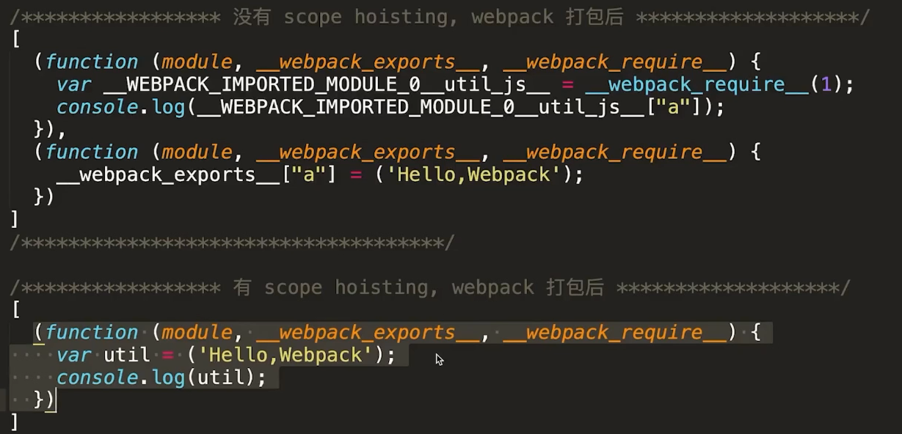
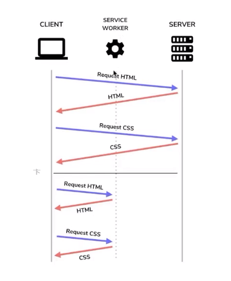
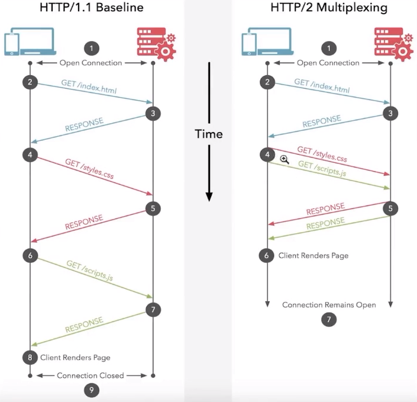

# 最佳实践

## 按需做事-不提前做

按需做事，即在代码中计算和取值应该在需要的地方进行，而不是提前进行。这是因为如果在逻辑判断之前就进行计算，而后面的逻辑判断没有进入，那么这段代码就会白白消耗时间，从而降低了代码的效率。因此，按需做事是一种更加高效的编程方式。

在函数中，有时我们会提前获取或计算所有属性，但是如果后面的逻辑判断没有用到这些属性，那么这部分计算就是无效的，浪费了时间和资源。因此，我们应该尽可能地按需获取和计算属性，以提高代码的效率和性能。此外，我们还可以通过使用缓存等技术来避免重复计算，从而进一步提高代码的效率。

```js
const a = obj.a;
const b = slowFn();
if (xxxx) {
  return a;
} else if (xxx) {
  return b;
}
```

### V8 优化机制

1. 脚本流 边加载边解析
2. 字节码缓存 多个页面使用相同解析后的字节码会缓存
3. 懒解析 函数不用会先不解析

### 函数解析优化

懒解析 vs 饥饿解析

饥饿解析 使用 一对 '()' .

### 对象优化

1. 以相同顺序初始化对象成员，避免隐藏类的调整
2. 实例化后避免添加新的属性 像这样 person.age = 17
3. 尽量使用 Array 代替 array-like 对象
4. 避免读取超过数组的长度
5. 避免元素类型的转换

### HTML 优化

1. 减少 iframes 的使用
2. 压缩空白符
3. 避免节点深层级嵌套
4. CSS&Javascript 尽量使用外链
5. 删除元素默认属性

ul > li 可以不写闭合

### CSS 优化

1. 降低 CSS 对渲染的阻塞
2. 利用 GPU 完成动画
3. contain：layout 开发者和浏览器沟通的一个属性，告诉浏览器只影响当前盒子
4. 使用 font-display 属性

## webpack 构建优化

### Tree-shaking

- 上下文未用到的代码（dead code）
- 基于 ES6 import export
- package.json 中配置 sideEffects ：有些代码有副作用可能不想打包时去掉，可以配置这个属性
- 注意 Babel 默认配置的影响 会转换 ES6 的语法，可能导致上面基于 ES6 的 shaking 失效，可以配置 modules: false

### JS 压缩

- webpack4 引入的 uglifyjs-webpack-plugin
- 支持 ES6 的 terser-webpack-plugin

### 作用域提升（scope hoisting）

​​

默认是开启的

- 代码体积减小
- 提高执行效率
- Babel 的 modules 也要设置成 hoist

### Babel7 优化配置

- 在需要的地方引入 polyfill
- 辅助函数按需引入 useBuiltIns: usage
- 根据目标浏览器按需转换代码

### Webpack 依赖优化

#### [noParse](https://www.webpackjs.com/configuration/module/#modulenoparse)

- 提高构建速度
- 直接通知 webpack 忽略较大的库
- 被忽略的库不能有 import、require、define 的引入方式，就是不能是模块化的

#### DllPlugin- 动态链接库

- 避免打包时对不变的库重复构建
- 提高构建速度
- 针对开发环境

‍

```js
// webpack.dll.config.js
output: {
	filename: "[name].dll.js",
	path: resolve(__dirname, "dll"),
	library: "[name]"
},
plugin: [
	new webpack.DllPlugin({
		name: "[name]",
		path: resolve(__dirname, "dll/[name].manifest.json") // 描述文件
	})
]
```

在 config 文件直接引用描述文件

### 代码拆分 （code splitting)

- 把单个 bundle 文件拆分成几个小的 bundles/chunks
- 缩短首屏加载时间
- 手工定义入口
- splitChunks 提取公共代码，拆分业务代码和第三方库

```js
optimization: {
    splitChunks: {
        cacheGroups: {
            vendor: {
                name: 'vendor',
                test: /[\\/]node_modules[\\/]/,
                minSize: 0,
                minChunks: 1,
                priority: 10,
                chunks: 'initial'
            },
            common: {
                name: 'common',
                test: /[\\/]src[\\/]/,
                chunks: 'all'
            }
        }
    }
}
```

- 动态加载

### 基于 webpack 的资源压缩（minification）

- Terser
- mini-css-extract-plugin 压缩 css
- HtmlWebpackPlugin- 压缩 html

### 基于 webpack 的资源持久化缓存

- 每个打包的资源文件有唯一的 hash 值
- 修改后只有受影响的文件 hash 变化
- 充分利用浏览器缓存

### 基于 webpack 应用大小监测与分析

- stats 分析与可视化图
- webpack-bundle-analyzer 体积分析 或者 [source-map-explorer](https://www.npmjs.com/package/source-map-explorer) 可以直接显示大小和占比，需要生成 sourcemap
- [speed-measure-webpack-plugin](https://www.npmjs.com/package/speed-measure-webpack-plugin) 速度分析，可以检测使用的插件效率如何

### React 按需加载

- React Router 基于 webpack 动态引入
- 使用 Reloadable 高级组件

## 传输优化

### Gzip

- gzip_comp_level 压缩级别，越高压缩比越大也越耗性能
- gzip_min_length 当返回内容大于此值时才会使用 gzip 进行压缩
- gzip_types 设置需要压缩的 MIME 类型,如果不在设置类型范围内的请求不进行压缩

- 对传输资源进行体积压缩，可达 90%

### Keep Alive

- keeplive_timeout 0 不启用
- keepalive_requests 设置一个 keep-alive 连接上可以服务的请求的最大数量，当最大请求数量达到时，连接被关闭。默认是 100

### Http 缓存

- Cache-Control/Expires
- Last-Modified + If-Modified-Since
- Etag+ If-None-Match

### Service Workers

- 加速重复访问
- 离线支持

#### 原理

​​

离线的时候是从 service worker 拿资源

#### 注意

- 延长了首屏时间，但是页面总加载时间减少
- 兼容性
- 只能在 localhost 或 https 下使用

### Http2

- 二进制传输
- 请求响应多路复用
- Server push
- 适合较高请求量

本地开发时，如果提示不安全网站，可以直接键盘输入 “thisisunsafe”

​​​

## 服务端渲染 SSR

- 加速首屏加载
- 更好的 SEO

#### 什么时候用 SSR

- 架构- 大型、动态页面、面向公众
- 搜索引擎排名很重要

‍
