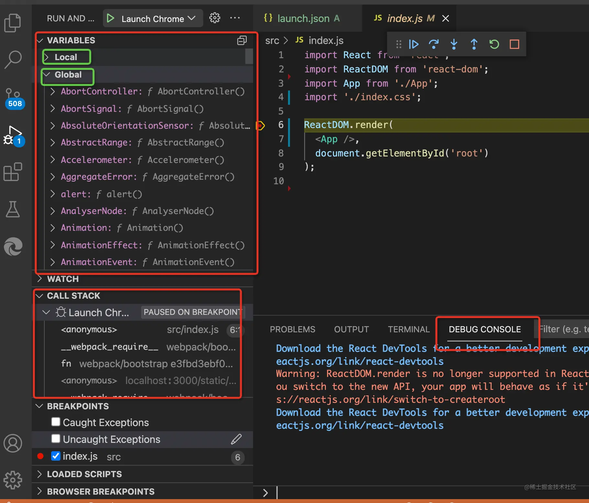

## 各类调试工具原理

### Chrome DevTools 原理

Chrome DevTools 分为两部分，backend 和 frontend：

- backend 和 Chrome 集成，负责把 Chrome 的网页运行时状态通过调试协议暴露出来。
- frontend 是独立的，负责对接调试协议，做 UI 的展示和交互。

两者之间的调试协议叫做 Chrome DevTools Protocol，简称 CDP。

传输协议数据的方式叫做信道（message channel）。

​​

### VSCode Debugger 原理

VSCode Debugger 的原理和 Chrome DevTools 差不多，也是分为 frontend、backend、调试协议这几部分，只不过它多了一层适配器协议。

​​

因为 VSCode 不是 JS 专用编辑器呀，它可能用来调试 Python 代码、Rust 代码等等，自然不能和某一种语言的调试协议深度耦合，所以多了一个适配器层。

​​

### Vue/React DevTools

Chrome 插件中可以访问网页的 DOM 的部分叫做 Content Script，随页面启动而生效，可以写一些操作 DOM 的逻辑。还有一部分是后台运行的，叫做 Background，浏览器启动就生效了，生命周期比较长，可以做一些常驻的逻辑。如果是扩展 DevTools 的 Chrome 插件，那还有一部分 DevTools Page，是在 DevTools 里显示的页面。

​​

Content Script 部分可以操作 DOM，可以监听 DOM Event。

Backgroud 部分可以访问 extension api，可以和 Content Script 还有 DevTools Page 通信。

DevTools Page 部分可以访问 devtools api，可以向当前 window 注入 JS 执行。

**frontend、backend、调试协议、信道，这是调试工具的四要素。**

不过，不同的调试工具都会有不同的设计，比如 VSCode Debugger 为了跨语言复用，多了一层 Debugger Adapter，React DevTools 有独立的 electron 应用，用自定义调试协议，可以调试 React Native 代码。

### 使用 vscode 调试 chrome

1. 打开项目目录，创建 .vscode/launch.json 文件：​

2. 点击右下角的 Add Configuration... 按钮，选择 Chrome: Launch​

3. 把访问的 url 改为开发服务器启动的地址：​

4. 然后进入 Debug 窗口，点击启动：​

5. 在代码打个断点，然后点击刷新：

6. 可以看到在断点处暂停​

7. 想访问 this 的某个属性，可以在 Debug Console 里输入 this 看下它的值，然后再来写代码：​

### Vscode Snippets

#### 语法

- 指定光标位置：$x
- 多光标编辑：\$x \$x
- 指定 placeholder 文本：${x:placeholder}
- 指定多选值：${x|aaa,bbb|}
- 取变量：$VariableName [vscode 变量](https://code.visualstudio.com/docs/editor/userdefinedsnippets#_variables)
- 对变量做转换：${VariableName/正则/替换的文本/}

## Performance

[fiber 测试页面](https://claudiopro.github.io/react-fiber-vs-stack-demo/fiber.html "fiber测试")

### Main 主线程

​​

灰色的是宏任务，橙色的是浏览器内部的 js，紫色的是 reflow、repaint， 绿色的是渲染。

其它的是用户执行的 js。

放大后可以看到先执行的 requestAnimationFrame 的回调，然后是回流重绘，最后是渲染。

​​​​

而且这种任务是每 13.3ms 执行一次，因为我的电脑是 75hz 的刷新率，1000 / 75 = 13.3 ms。如果一个任务执行时间超长，比如 50 多 ms，那它就相当于垮了好几帧，就会发生卡顿掉帧，因为阻塞了渲染的宏任务执行。

**性能优化就是为了优化长的宏任务**

长任务会标红

​​

1. requestIdleCallback 回调是宏任务

   ​​

2. 垃圾回收也是

   ​

3. 定时器也是

   ​

4. 执行 script

   ​​

5. parse Html

   ​

6. micro tasks 是 task 的一部分

   ​​

rAF 调用栈末尾还有个 requestAnimationFrame 的调用，是浏览器把下次 rAF 回调加入 Event Loop。

​

在一帧里面，先执行 rAF，然后再执行 rIC。

​​

这种很长的看着像是递归

​​​​

### Frames

​​

- 白色：没有变化
- 绿色：按预期及时渲染
- 黄色：浏览器尽最大努力及时呈现至少一些视觉更新，比如滚动了但主线程没空
- 红色：掉帧，无法在合理的时间内渲染帧，比如：`scroll`​，`resize` ​ 事件触发过于频繁,浏览器来不及处理导致在下一个事件被触发之前无法完成

‍
