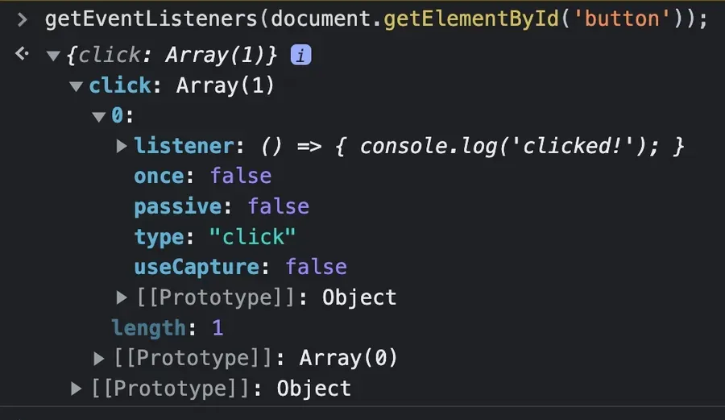
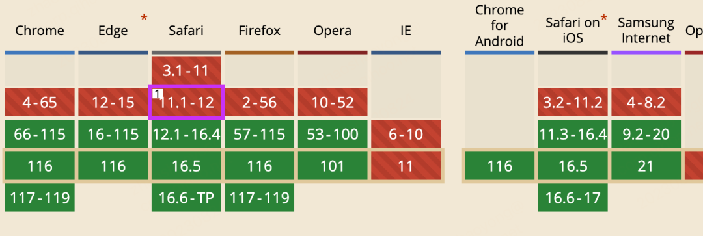

在运行时清理代码是构建高效、可预测应用程序的必不可少的部分。在 JavaScript 中，合理管理事件监听器，在不再需要监听事件的时候将它们移除是必要的。

用下面代码进行实验 ：

```js
<button id="button">Do Something</button>

<script>
document.getElementById('button').addEventListener('click', () => {
  console.log('clicked!');
});
</script>
```

使用 Chrome getEventListeners() 函数，您将看到只有一个监听器附加到该元素：

​​

### 使用 removeEventListener

​`removeEventListener`​ 方法接受三个参数：要移除的监听器类型、该监听器的回调函数以及一个选项对象。

但是棘手之处在于：这些参数必须和设置监听器时使用的参数完全匹配，包括相同的回调引用。否则`removeEventListener()`​ 将不起作用。  
鉴于此，以下操作将是完全无效的：

```js
document.getElementById("button").addEventListener("click", () => {
  console.log("clicked!");
});

document.getElementById("button").removeEventListener("click", () => {
  console.log("clicked!");
});
```

尽管移除监听的回调看起来与最初绑定的回调完全相同，但它们并不是相同的引用。解决此问题的方法是将回调函数设置为变量，并在`.addEventListener()`​ 和 `.removeEventListener()`​ 中使用它。

```js
const myCallback = () => {
  console.log("clicked!");
};

document.getElementById("button").addEventListener("click", myCallback);
document.getElementById("button").removeEventListener("click", myCallback);
```

或者，对于特定的场景，您还可以使用在函数内部使用函数名来删除监听器：

```js
document
  .getElementById("button")
  .addEventListener("click", function myCallback() {
    console.log("clicked!");

    this.removeEventListener("click", myCallback);
  });
```

### 使用 addEventListener 的 once 选项

​`addEventListener()`​ 方法的第二个对象参数有一个选项：`once`​ 选项，可以用来设置在仅打算使用一次的情况下自行清除事件绑定。它的使用和听起来一样简单，如果将其设置为 `true`​，则监听器在第一次被调用后会自动被移除：

```js
const button = document.getElementById("button");

button.addEventListener(
  "click",
  () => {
    console.log("clicked!");
  },
  { once: true }
);

// 'clicked!'
button.click();

// No more listeners!
getEventListeners(button); // {}
```

即使使用匿名函数，这种方法也是有效的，你的监听器只会被调用一次。

### 克隆和替换节点

有时，你可能不知道给定节点上的所有活动监听器，但你想要将它们全部移除。在这种情况下，可以克隆整个节点并用该克隆节点替换自身。使用 .cloneNode() 方法，通过 `.addEventListener()`​ 附加的任何监听器都不会被保留，从而获得一个干净的节点。

在客户端 JavaScript 的石器时代，您会看到通过查询父节点，并替换特定子节点以进行此操作：

```js
button.parentNode.replaceChild(button.cloneNode(true), button);
```

但在现代浏览器中，可以使用 `.replaceWith()`​ 进行简化：

```js
button.replaceWith(button.cloneNode(true));
```

这里唯一可能让你困扰的是，行内监听器会被保留，这意味着 `onclick`​ 事件仍会被触发：

```js
<button id="button" onclick="console.log('clicked!')">
  Do Something
</button>
```

总的来说，如果你需要删除任何类型的监听器，这是一个不错的选择。它的缺点是目的不明显，有些讨巧。

### 使用 AbortController()

​`.addEventListener()`​ 可以配置一个信号，用于命令式地中止/删除监听器。当相应的控制器调用 `.abort()`​ 时，监听器会被移除：

```js
const button = document.getElementById("button");
const controller = new AbortController();
const { signal } = controller;

button.addEventListener("click", () => console.log("clicked!"), { signal });

// Remove the listener!
controller.abort();
```

上面的方法是一种更明了的方式，可以在不需要处理 `.removeEventListener()`​ 的潜在陷阱的情况下移除监听器。还有一个更大的优势：您可以使用一个信号一次性删除多个监听器，使用匿名函数也可以：

```js
const button = document.getElementById("button");
const controller = new AbortController();
const { signal } = controller;

button.addEventListener("click", () => console.log("clicked!"), { signal });
window.addEventListener("resize", () => console.log("resized!"), { signal });
document.addEventListener("keyup", () => console.log("pressed!"), { signal });

// Remove all listeners at once:
controller.abort();
```

唯一需要考虑的是浏览器支持。

​​

### 我应该选择哪种方法？

一般来说，“视情况而定”。不过我可能会这样选择：

- 如果回调函数分配给变量，并且在添加监听器的地方容易访问，请使用 `.removeEventListener()`​。
- 如果只需要触发一次回调，请在 `.addEventListener()`​ 中使用 `once`​ 选项。
- 如果需要在一次操作中无差别地删除所有的监听器，请使用克隆替换方法。
- 如果有一系列监听器希望命令式地一次性删除，请使用 `AbortController()`​

原文地址：

[You’ve Got Options for Removing Event Listeners](https://www.macarthur.me/posts/options-for-removing-event-listeners "You’ve Got Options for Removing Event Listeners")

‍
