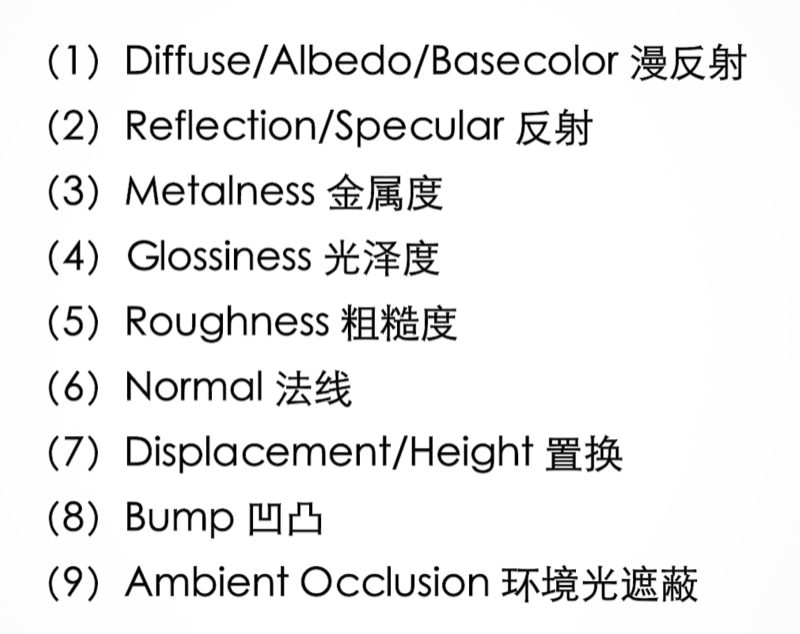

​diffuse/base colos/albedo颜色贴图： 漫反射可以简单理解成物体表面固有的颜色

reflection/specular反射贴图：白色全反射黑色不反射（排除金银铜等金属）

metalness金属度： 纯白金属 黑色电解质

glossiness光泽度： 材质的粗糙程度 白色光滑，黑色粗糙

roughness粗糙度： 与上面相反

normal蓝色法线 用rgb代表xyz三个方向上的位移值，本质改变了光线在材质表面的传播方式，没有产生模型形变， OpenGl（+X, +Y, +Z), DirectX（+X， -Y，+Z）

displacement/height置换贴图： 黑色不变，白色凸起

bump凹凸： 与置换相同但只改变光线效果，没有改变模型，使之产生形变

AO环境光遮蔽： 物体相交或者靠近时遮挡附近漫反射光线，前提是发生了置换效果

1. 颜色信息（漫反射）
2. 反射信息（反射、光泽度）
3. 高度信息（法线、凹凸、置换）
