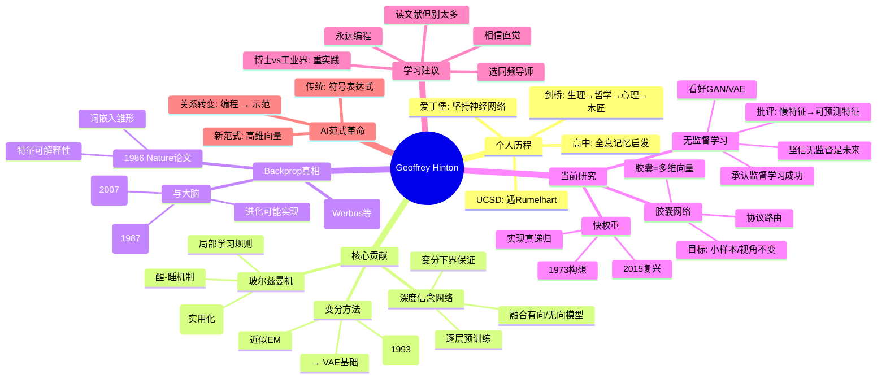

---

### 一、个人学术历程：从哲学到神经网络

|阶段|经历|关键转折|
| --------------------| --------------------------------------------------------------------------------| ----------------------------------|
|​**高中时期**（1966年左右）|同学提及“大脑使用全息图存储记忆” → 受Lashley大鼠实验启发|对**分布式记忆**产生兴趣|
|**剑桥大学本科**|先学生理+物理 → 转哲学（认为缺乏判断真假的方法）→ 再转心理学（理论过于简陋）|意识到传统学科无法解释大脑智能|
|**短暂休学**|成为木匠|反思后决定投身AI|
|**爱丁堡大学博士**|师从Langer Higgins（已放弃神经网络，推崇符号AI）|坚持神经网络方向，与导师激烈争论|
|**加州圣地亚哥（UCSD）**|遇David Rumelhart、Don Norman等开放思想者|进入神经网络研究黄金期|

> ✅ ​**启示**​：跨学科背景 + 坚持直觉 + 找到志同道合的环境 \= 创新土壤

---

### 二、三大核心技术贡献（辛顿自评最自豪）

#### 1. **玻尔兹曼机（Boltzmann Machines）**

- ​**核心思想**：用简单学习算法训练全连接网络，仅观测部分节点。
- ​**优势**：

  - 学习规则局部（每个突触只需前后神经元信息）
  - “醒-睡”两阶段传播机制，更接近生物神经活动
- ​**演进**：受限玻尔兹曼机（RBM） → 实际可用（如Netflix竞赛）

#### 2. **深度信念网络（Deep Belief Nets, DBN）**

- ​**方法**：逐层预训练RBM → 将特征作为新数据 → 叠加多层
- ​**突破**：

  - 首次实现**高效深度网络训练**
  - 提供​**变分下界（variational bound）保证**：每加一层，模型下界提升
  - 融合​**有向图模型**​（Sigmoid belief net）与**无向能量模型**

#### 3. **变分推断与近似EM算法**

- ​**关键论文**​：1993年与Van Camp提出**首个变分贝叶斯神经网络**
- ​**贡献**：

  - 证明​**E步无需精确**，近似即可有效
  - 使贝叶斯学习在神经网络中变得可行
  - 为现代**变分自编码器（VAE）**  奠定基础

> 🔍 注：辛顿强调这些工作当时被忽视，多年后才被认可。

---

### 三、关于反向传播（Backpropagation）的真相

- ​**并非原创**：Werbos（1974）、Parker 等人早有类似想法
- **为何1986年论文引爆社区？**

  - 发表于《Nature》
  - 展示​**词嵌入雏形**：通过家庭树任务（如“Mary has mother Victoria”）学习语义向量
  - 向审稿人Stuart Sutherland清晰解释**特征可解释性**
- ​**与大脑的关系**：

  - 辛顿坚信：**进化很可能实现了类似backprop的机制**
  - 提出替代方案：

    - ​**Recirculation算法**（1987）：通过循环稳定活动学习
    - ​**重建误差导数法**（2007）：堆叠自编码器中，重建误差 ≈ 判别梯度

> 💡 观点：大脑可能用“预测编码”或“重建反馈”实现类backprop功能

---

### 四、当前研究方向（截至访谈时）

#### 1. **胶囊网络（Capsule Networks）**

- ​**核心理念**：

  - 用**胶囊（capsule）**  替代单个神经元
  - 每个胶囊输出​**多维向量**，表示一个实体的多种属性（位置、朝向、颜色等）
  - 前提：**局部区域最多存在一个该类实体**
- ​**路由机制**​： **“协议路由”（Routing by Agreement）**

  - 下层胶囊投票上层参数
  - 高维空间中“一致”极难偶然发生 → 强分割能力
- ​**目标**​：提升​**小样本泛化**​、​**视角不变性**​、**对象分割**

#### 2. **快权重（Fast Weights）**

- ​**起源**：1973年未发表构想
- ​**机制**：快速变化但快速衰减的权重 → 存储短期记忆
- ​**用途**​：实现​**真递归**（reuse neurons & weights in recursion）
- ​**复兴**：2015年与Jimmy Ba合作发表ICLR论文

#### 3. **无监督学习的再思考**

- ​**承认现实**​：过去十年**监督学习**主导成功（如预测下一个词）
- ​**仍坚信**​：**无监督学习是未来关键**
- ​**看好方向**：

  - **变分自编码器（VAE）**
  - **生成对抗网络（GAN）**  → “深度学习中最重大的新思想之一”
- ​**批评旧思路**：

  - “稀疏性”非普适原则
  - “慢特征”应改为“​**可预测变化的特征**”

> 🎯 核心建模原则：  
> **将观测通过非线性变换 → 映射到状态空间 → 在该空间中动力学为线性**  
> （例：像素 → 3D坐标 → 矩阵变换视角 → 重建像素）

---

### 五、给学习者的职业建议

#### ✅ 行动指南：

1. **读文献，但别读太多**

    - 读一点 → 发现“哪里不对劲” → 相信直觉去改进
2. **永远不要停止编程**

    - 复现论文 → 发现“魔鬼细节” → 培养工程直觉
3. **选择志同道合的导师**

    - 导师若认同你的方向，会倾力指导
4. **面对质疑，坚持好想法**

    - “如果别人说你完全错了，那你可能真发现了什么”

#### 🎓 博士 vs 工业界？

- ​**现状**：高校深度学习师资严重不足
- ​**趋势**：大公司（如Google Brain）承担大量人才培养
- ​**建议**​：不必拘泥路径，**能接触前沿研究+持续实践**更重要

> 💬 辛顿金句：  
>  **“要么你的直觉好，那就追随它；要么不好，那做什么都一样——所以不如相信直觉。”**

---

### 六、AI范式革命：从符号到向量

|传统AI（符号主义）|辛顿主张（联结主义）|
| ---------------------------------------| ---------------------------------------|
|思维 \= 符号表达式（如逻辑公式）|思维 \=**高维神经活动向量**|
|智能 \= 推理|智能 \=**表示 + 预测**|
|输入/输出是字符串 → 中间也应是字符串|输入/输出是词 → 中间是​**稠密向量**（非语言）|
|编程计算机|**向计算机展示（showing）**|

> 🌍 辛顿断言：  
>  **“我们与计算机的关系已根本改变——从编程到示范，这堪比工业革命。”**

---

## 🧩 Mermaid 脑图

---

> ✅ ​**使用说明**：  
> 将上述 Mermaid 代码粘贴至支持 Mermaid v11+ 的编辑器（如 Typora、Obsidian、Mermaid Live Editor）即可生成交互式脑图。

---

　　希望这份结构化总结助你深入理解辛顿的思想脉络与技术洞见。正如他所言： **“伟大的想法，往往始于他人眼中的‘荒谬’。”**  —— 保持好奇，勇敢探索。
