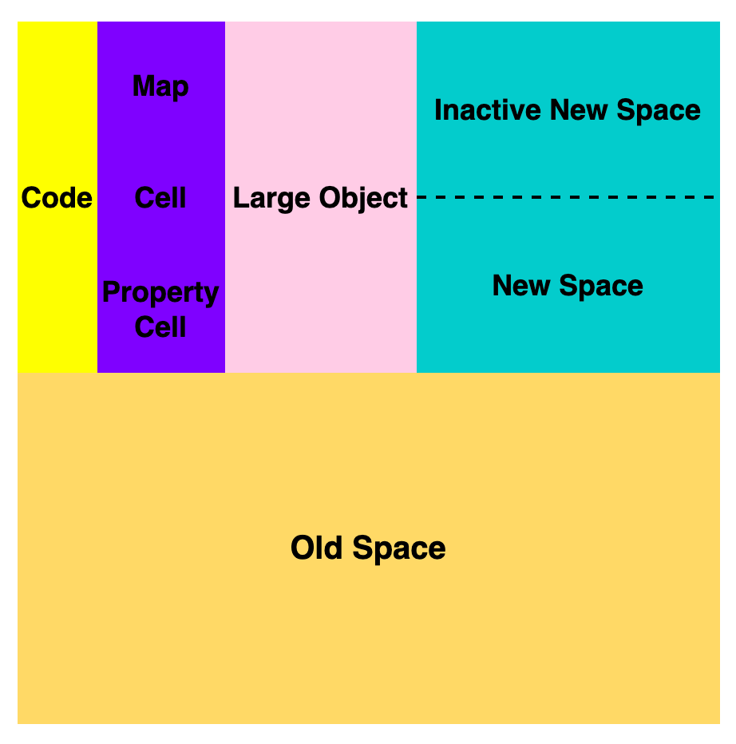

## 内存管理

垃圾回收算法被分为两种，一个是 Major GC，主要使用了 Mark-Sweep & Mark-Compact 算法，针对的是堆内存中的老生代进行垃圾回收；另外一个是 Minor GC，主要使用了 Scavenger 算法，针对于堆内存中的新生代进行垃圾回收。V8 引擎的新生代内存大小^（ 网传主流说法，没有找到具体的源码，仅做参考。）^ ~~32MB(64 位)、16MB(32 位)~~ ；老生代初始内存大小为 512MB(64 位)、256MB(32 位)，默认配置下最大可以增加到 4GB。

```js
const int kSystemPointerSize = sizeof(void*); // 32位 -> 4；64位 -> 8
static const int kHeapLimitMultiplier = kSystemPointerSize / 4;

// 老生代初始极值
static const size_t kMaxInitialOldGenerationSize = 256 * MB * kHeapLimitMultiplier;
static const size_t kOldGenerationLowMemory = 128 * MB * kHeapLimitMultiplier;
```

- **新生代**(new space)，大多数的对象开始都会被分配在这里，这个区域相对较小但是垃圾回收特别频繁，该区域被分为两半，一半用来分配内存，另一半用于在垃圾回收时将需要保留的对象复制过来。

  - Semi Space，**from space** 和 **to space** 动态更换。
  - 采用`Scavenge`​ 算法(复制算法)进行垃圾回收。
  - 对象晋升：对象是否经历过一次 Scavenge 算法；To 空间的内存占比是否已经超过 25%。

​​

- **老生代**(old space)，新生代中的对象在存活一段时间后就会被转移到老生代内存区，相对于新生代该内存区域的垃圾回收频率较低。老生代又分为老生代指针区和老生代数据区，前者包含大多数可能存在指向其他对象的指针的对象，后者只保存原始数据对象，这些对象没有指向其他对象的指针。
- **大对象区**(large object space)：存放体积超越其他区域大小的对象，每个对象都会有自己的内存，垃圾回收不会移动大对象区。
- **代码区**(code space)：代码对象，会被分配在这里，唯一拥有执行权限的内存区域。
- **Map 区**(map space)：存放 Cell 和 Map，每个区域都是存放相同大小的元素，结构简单，可以理解为**隐藏类**。

​​

JavaScript 在运行时，对象的属性是可以被修改的，这对于 V8 是存在不确定性的。像 C++ 这类静态语言，在编译阶段就确定对象的结构，可以直接通过偏移量来查询目标对象的各项属性值，因此运行效率非常高。V8 对每个对象做出两个假设：

- 对象创建完成后不会添加新的属性。
- 对象创建完成后不会删除属性。

基于上述假设，V8 会给每个对象创建**隐藏类**(Hideen Class)，用于记录该对象的基础布局信息，具体包括：

- 对象的所有属性。
- 所有属性的相对偏移值。

那么当 V8 访问某个对象的某个属性时，就会先去隐藏类中查找该属性相对于该对象的偏移量，也就能去内存中直接取值，从而跳过一系列的查找过程，大大提升 V8 查找对象的属性值的效率。

V8 的每个对象都有 map 属性，该字段指向该对象的隐藏类。当两个对象的结构相同^（ 相同的属性名称；相等的属性个数；一致的属性顺序。）^时，就会复用同一个隐藏类，这样可以减少隐藏类的创建次数以及减少存储空间。而当结构发生变更时，就会重新创建隐藏类。因此在开发过程中，为提高 V8 引擎性能，需要注意以下几点：

- 尽量使用字面量一次性初始化完整的对象属性。
- 尽量保证初始化时属性的顺序一致。
- 尽量避免使用 delete 方法。

```JS
// --allow-natives-synta 指向同一地址，故复用同一个隐藏类
const JnQ = { name: 'JnQ', owner: 'Qi Huang', TL: 'Sijie Cai' };
const TCSplus = { name: 'TCS', owner: 'Guangyu Song', TL: 'Sijie Cai' };

// 重新创建隐藏类 Case 1
const JnQInfo = {}; // 新建隐藏类第 1 次
JnQInfo.platform = ['Jimu', 'Juren', 'Rock']; // 新建隐藏类第 2 次
JnQInfo.member = 13; // 新建隐藏类第 3 次
JnQInfo.meeting = 'Firday'; // 新建隐藏类第 4 次

// 重新创建隐藏类 Case 2
const JnQInfo = { platform: ['Jimu', 'Juren', 'Rock'], member: 13, meeting: 'Firday' }; // 新建隐藏类第 1 次
delete JnQInfo.meeting; // 新建隐藏类第 2 次
delete JnQInfo.platform; // 新建隐藏类第 3 次

// 重新创建隐藏类 Case 3
const jimu = { member: 8, owner: 'Zhihao Cao' }; // 新建隐藏类第 1 次
const quality = { owner: 'Xue Zhang', member: 4 }; // 新建隐藏类第 2 次
```

## 垃圾回收

- 根节点认定：全局对象；本地函数的局部变量和参数；当前嵌套调用链上的其他函数的变量和参数。
- 标记-整理

  - 经历一次标记-清除后，内存空间可能会出现不连续的状态，即内存碎片；
  - 假设在老生代中有 A、B、C、D 四个对象；
  - 在垃圾回收的标记阶段，将对象 A 和对象 C 标记为活动的；
  - 在垃圾回收的整理阶段，将活动的对象往堆内存的一端移动；
  - 在垃圾回收的清除阶段，将活动对象左侧的内存全部回收。

​​

- 增量标记

  - 由于 JS 的单线程机制，垃圾回收的过程会阻碍主线程同步任务的执行，待执行完垃圾回收后才会再次恢复执行主任务的逻辑，这种行为被称为**全停顿**(stop-the-world)。在标记阶段同样会阻碍主线程的执行，一般来说，老生代会保存大量存活的对象，如果在标记阶段将整个堆内存遍历一遍，那么势必会造成严重的卡顿。
  - 因此，为了减少垃圾回收带来的停顿时间，V8 引擎又引入了`Incremental Marking`​(增量标记)的概念，即将原本需要一次性遍历堆内存的操作改为增量标记的方式，先标记堆内存中的一部分对象，然后暂停，将执行权重新交给 JS 主线程，待主线程任务执行完毕后再从原来暂停标记的地方继续标记，直到标记完整个堆内存。这个理念其实有点像 React 框架中的 Fiber 架构，只有在浏览器的空闲时间才会去遍历`Fiber Tree`​ 执行对应的任务，否则延迟执行，尽可能少地影响主线程的任务，避免应用卡顿，提升应用性能。
  - 得益于增量标记的好处，V8 引擎后续继续引入了延迟清理(`lazy sweeping`​)和增量式整理(`incremental compaction`​)，让清理和整理的过程也变成增量式的。同时为了充分利用多核 CPU 的性能，也将引入**并行标记**和**并行清理**，进一步地减少垃圾回收对主线程的影响，为应用提升更多的性能。

​​

## 编译解析

**编译型语言**在程序执行之前，需要经过**编译器**的编译过程，并且编译之后会直接保留机器能读懂的二进制文件，这样每次运行程序时，都可以直接运行该二进制文件，而不需要再次重新编译了。比如 C/C++、GO 等都是编译型语言。而由**解释型语言**编写的程序，在每次运行时都需要通过**解释器**对程序进行动态解释和执行。比如 JavaScript、Python 等都属于解释型语言。

​V8 在执行过程中既有解释器 Ignition，又有编译器 TurboFan，此外较新版本的 Chrome 增加了一种中间层编译器 Maglev，V8 可以使用 jsvu 进行本地调试。

解释编译具体步骤包括：

- 生成抽象语法树和执行上下文

  - 词法分析，即分词(tokenize)，根据预设规则将每一行代码拆分成不可再分的 tokens。
  - 语法分析，即解析(parse)，根据语法规则将 tokens 组合转化为抽象语法树。
  - 执行上下文，代码执行过程中的环境信息。

- 生成字节码

  - 字节码介于 AST 和机器码之间。字节码需要通过解析器将其转换为机器码后才能执行。
  - 解释器 Ignition 会根据 AST 生成字节码，并解释执行字节码。
  - V8 最早并没有字节码，直接将 AST 转换为机器码效率更加高效，但机器码的内存占用远远大于字节码，这在移动端的问题更加突出。

```js
// JavaScript Code - 8 lines of code
const foo = (day) => {
  const department = 'Data-TnS-FE';
  const team = 'JnQ';
  return day % 2 === 0 ? department : team;
};
for (let day=0; day < 0x20227; day++) {
  foo(day);
}

// V8 bytecode - 19 lines of code
// --print-bytecode
CreateClosure [0], [0], #0
StaCurrentContextSlot [2]
LdaZero
Star11
LdaUndefined
...

// Machine Code - 140 lines of code
// --print-code
REX.W leaq rbx,[rip+0xfffffff9]
REX.W cmpq rbx,rcx
jz 0x174944159  <+0x19>
movl rdx,0x84
call [r13+0x50a0]
int3l
movl rbx,[rcx-0xc]
REX.W addq rbx,r14
testb [rbx+0x16],0x20
jnz 0x1149c5a00  (CompileLazyDeoptimizedCode)    ;; near builtin entry
...

```

​​

- 执行代码

  - Ignition 负责生成、解析和执行字节码。执行字节码的过程中如果发现一段代码被重复执行多次，就会将其标记为为**热点代码**(HotSpot)，那么后台的编译器 TurboFan 就会把该段热点字节码编译为更为高效的机器码(即时编译，JIT)，当再次执行这段被优化的代码时，只需要执行编译后的机器码就可以了，这样就可以兼顾代码的执行效率和内存占用。

​​

**惰性解析**是指解析器在解析的过程中，如果遇到函数声明，那么会跳过函数内部的代码，并不会为其生成 AST 和字节码，而仅仅生成顶层代码的 AST 和字节码。

- 一次性解析和编译所有的 JavaScript 代码会增加编译时间，严重影响到首次执行 JavaScript 代码的速度。
- 一次性解析和编译所有 JavaScript 代码会增加内存占用，解析完成的字节码和编译后的机器代码将会一直占用内存。

## 循环机制

### 事件循环

每个渲染进程都有一个主线程负责处理 DOM、计算样式、排版布局、运行 JavaScript 代码以及响应交互行为。单线程来调度这些任务就需要消息队列和事件循环分别承担任务存储和处理的工作。

渲染进程有专门用来接收其他进程传进来消息的 IO 线程。消息队列的任务类型有很多，如外设输入事件、文件读写、定时器、解析 DOM、样式计算、布局计算、CSS 动画等等。

“先进先出”是队列的特点，鉴于这个属性，就需要解决两个问题。

- 如何处理高优先级的任务。

  - 每个宏任务中都包含了一个微任务队列，宏任务执行完成后，会立即执行当前宏任务的微任务队列。

- 如何解决单任务执行时间过长。

消息队列分为**执行队列**和**延迟队列**两种。

​​

消息队列的任务是通过事件循环来执行的，WHATWG 规范是这么定义事件循环的宏任务执行过程：

1. 从多个消息队列中选出一个最老的任务，这个任务称为 oldestTask；
2. 循环系统记录任务开始执行的时间，并把这个 oldestTask 设置为当前正在执行的任务；
3. 当任务执行完成之后，删除当前正在执行的任务，并从对应的消息队列中删除掉这个 oldestTask；
4. 最后统计执行完成的时长等信息。

### 任务调度

一个事件循环模型有一个或者多个任务队列，**任务队列**是**集合**，而不是队列。因为事件循环处理模型从所选队列中选出第一个可执行的任务，而不是按照“先进先出”的原则。**微任务队列**不是**任务队列**，每个事件循环模型只且只有一个微任务队列，微任务队列是**队列**实现。并非所有事件都使用任务队列进行调度；许多是在其他任务执行期间派生的。

```js
immediate_incoming_queue; // PostTask enqueues tasks here
immediate_work_queue; // SequenceManager takes immediate tasks here.

delayed_work_queue; // PostDelayedTask enqueues tasks here.
delayed_incoming_queue; // SequenceManager takes delayed tasks here.
```

​`immediate_incoming_queue`​ 存放的任务在`immediate_work_queue`​ 清空以后进入等待执行，为了提高效率，两个队列会在清空时进行职能互换。`delayed_incoming_queue`​ 中的任务，将在延迟时间到期以后进入`delayed_work_queue`​ 等待执行。任务产生以后会先进入到相应的`incoming_queue`​ 等待，`work_queue`​ 存放即将被执行的任务。

延迟队列用于定时器或其他需要延时执行的任务，例如`setTimeout`​，由于执行任务都由渲染进程主线程来完成的缘故，定时器存在以下几个问题：

- 如果当前任务执行时间过长，会影响定时器任务的执行。
- 定时器存在嵌套关系，最短时间间隔为 4 毫秒。
- 未激活的页面，定时器最小执行间隔是 1000 毫秒。
- 延迟执行时间的最大值是 2147483647^(2147483647 毫秒 - Chrome、Safari、Firefox 都是以 32 个 bit 来存储延时值，超出 2\*31 -1 的最大范围则会立即执行(等价于 0 毫秒)。)^ 毫秒(约 24.8 天)。

异步回调有两种形式，第一种是把异步回调函数封装成一个**宏任务**，添加到消息队列尾部，当循环系统执行到该任务的时候执行回调函数；第二种方式的执行时机是在主函数执行结束之后、当前宏任务结束之前执行回调函数，这通常都是以**微任务**形式体现的。

在当前宏任务中的 JavaScript 快执行完成时，也就在 JavaScript 引擎准备退出全局执行上下文并清空调用栈的时候，JavaScript 引擎会检查全局执行上下文中的微任务队列，然后按照顺序执行队列中的微任务。如果在执行微任务的过程中，产生了新的微任务，同样会将该微任务添加到微任务队列中，V8 引擎一直循环执行微任务队列中的任务，直到队列为空才算执行结束。**也就是说在执行微任务过程中产生的新的微任务并不会推迟到下个宏任务中执行，而是在当前的宏任务中继续执行。**

早期 Mutation Event 采用观察者的设计模式，当 DOM 有变动时就会立刻触发相应的事件，这种方式属于同步回调，频繁触发会导致页面性能问题。MutationObserver 将响应函数改成异步调用，可以不用在每次 DOM 变化都触发异步调用，而是等多次 DOM 变化后，一次触发异步调用，同时为了保证实时性，MutationObserver 触发的回调会进入微任务队列。

## 页面渲染

​

‍
