原文：[Inside look at modern web browser](https://developer.chrome.com/blog/inside-browser-part1/ "Inside look at modern web browser")

## Part 1

​​

​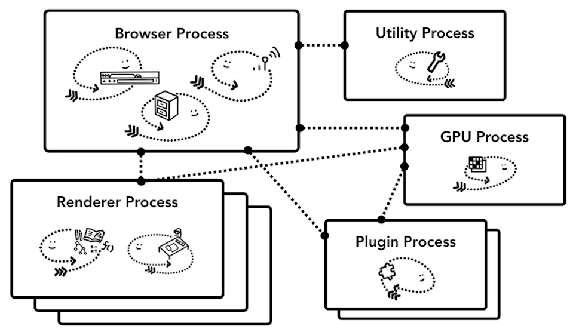​

Chrome 的多进程架构图，多个渲染进程的卡片（render process）是用来表明 Chrome 会为每一个 tab 创建一个渲染进程。

Chrome 浏览器会有一个浏览器进程（browser process），这个进程会和其他进程一起协作来实现浏览器的功能。对于渲染进程（renderer process），Chrome 会尽可能为每一个 tab 甚至是页面里面的每一个 iframe 都分配一个单独的进程。

### Chrome 多进程架构的好处

1. 多进程可以使浏览器具有很好的容错性。

   对于大多数简单的情景来说，Chrome 会为每个 tab 单独分配一个属于它们的渲染进程（render process）。举个例子，假如有三个 tab，就会有三个独立的渲染进程。当其中一个 tab 的崩溃时，可以随时关闭这个 tab 并且其他 tab 不受到影响。可是如果所有的 tab 都跑在同一个进程的话，它们就会有连带关系，一个挂全部挂。

​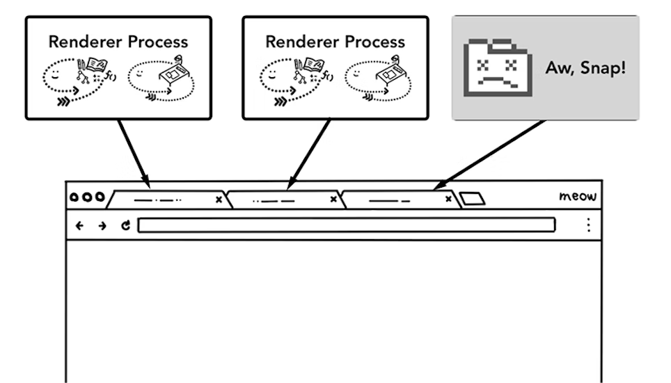​

2. 另外一个好处就是可以提供安全性和沙盒性（sanboxing）。

   因为操作系统可以提供方法让限制每个进程拥有的能力，所以浏览器可以让某些进程不具备某些特定的功能。例如，由于 tab 渲染进程可能会处理来自用户的随机输入，所以 Chrome 限制了它们对系统文件随机读写的能力。

3. 不好的地方

   那就是进程的内存消耗。由于每个进程都有各自独立的内存空间，所以它们不能像存在于同一个进程的线程那样共用内存空间，这就造成了一些基础的架构（例如 V8 JavaScript 引擎）会在不同进程的内存空间同时存在的问题，这些重复的内容会消耗更多的内存。所以为了节省内存，Chrome 会限制被启动的进程数目，当进程数达到一定的界限后，Chrome 会将**访问同一个网站的 tab 都放在一个进程里面跑**。

### 网站隔离

网站隔离功能会为网站内不同站点的 iframe 分配一个独立的渲染进程。之前说过 Chrome 会为每个 tab 分配一个单独的渲染进程，可是如果一个 tab 只有一个进程的话不同站点的 iframe 都会跑在这个进程里面，这也意味着它们会共享内存，这就有可能会破坏同源策略。同源策略是浏览器最核心的安全模型，它可以禁止网站在未经同意的情况下去获取另外一个站点的数据，因此绕过同源策略是很多安全攻击的主要目的。而进程隔离（proces isolation）是隔离网站最好最有效的办法了。这样每一个跨站点的 iframe 都会拥有一个独立的渲染进程。

​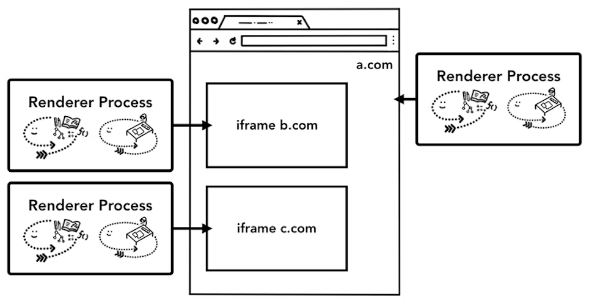​

## Part 2

### 输入 url 到显示（一次导航）发生了什么

浏览器进程有很多负责不同工作的线程（worker thread），其中包括绘制浏览器顶部按钮和导航栏输入框等组件的 UI 线程（UI thread）、管理网络请求的网络线程（network thread）、以及控制文件读写的存储线程（storage thread）等。当在导航栏里面输入一个 URL 的时候，其实就是 UI 线程在处理的输入。

​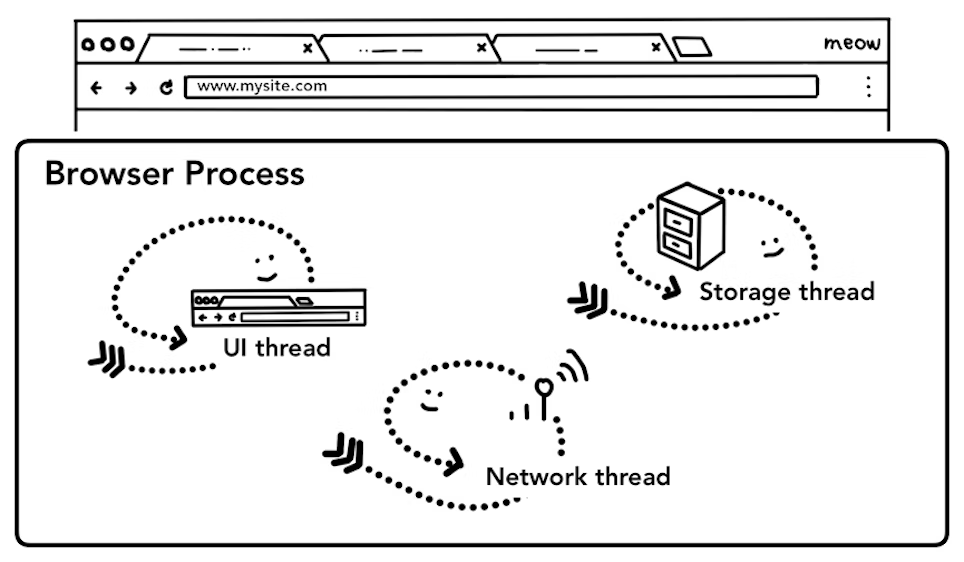​

### 一次简单的导航

#### 1. 处理输入

当用户开始在导航栏上面输入内容的时候，UI 线程（UI thread）做的第一件事就是询问：“输入的字符串是一些搜索的关键词（search query）还是一个 URL 地址呢？”。因为对于 Chrome 浏览器来说，导航栏的输入既可能是一个可以直接请求的域名还可能是用户想在搜索引擎（例如 Google）里面搜索的关键词信息，所以当用户在导航栏输入信息的时候 UI 线程要进行一系列的解析来判定是将用户输入发送给搜索引擎还是直接请求输入的站点资源。

​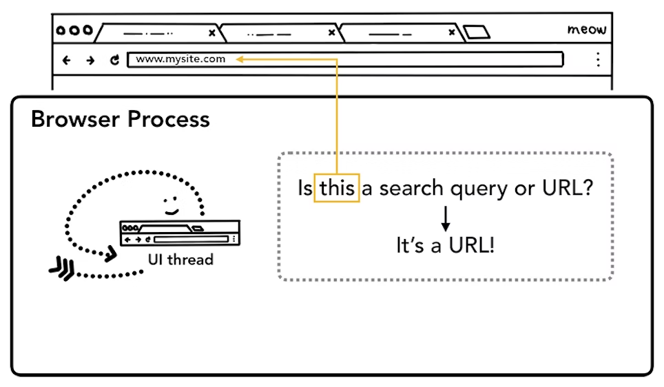​

#### 2. 开始导航

当用户按下回车键的时候，UI 线程会叫网络线程（network thread）初始化一个网络请求来获取站点的内容。这时候 tab 上会展示一个提示资源正在加载中的旋转圈圈，而且网络线程会进行一系列诸如 DNS 寻址以及为请求建立 TLS 连接的操作。这时如果网络线程收到服务器的 HTTP 301 重定向响应，它就会告知 UI 线程进行重定向然后它会再次发起一个新的网络请求。

​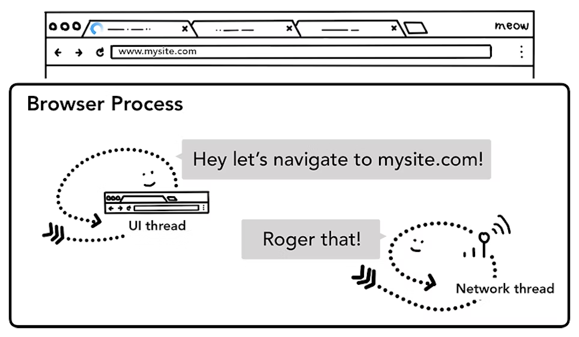​

#### 3. 读取响应

网络线程在收到 HTTP 响应的主体（payload）流（stream）时，在必要的情况下它会先检查一下流的前几个字节以确定响应主体的具体媒体类型（MIME Type）。响应主体的媒体类型一般可以通过 HTTP 头部的 Content-Type 来确定，不过 Content-Type 有时候会缺失或者是错误的，这种情况下浏览器就要进行 [MIME 类型嗅探](https://developer.mozilla.org/en-US/docs/Web/HTTP/Basics_of_HTTP/MIME_types "MIME类型嗅探")来确定响应类型了。MIME 类型嗅探并不是一件容易的事情，可以从 [Chrome 的源代码](https://source.chromium.org/chromium/chromium/src/+/main:net/base/mime_sniffer.cc;l=5 "Chrome的源代码")的注释来了解不同浏览器是如何根据不同的 Content-Type 来判断出主体具体是属于哪个媒体类型的。

​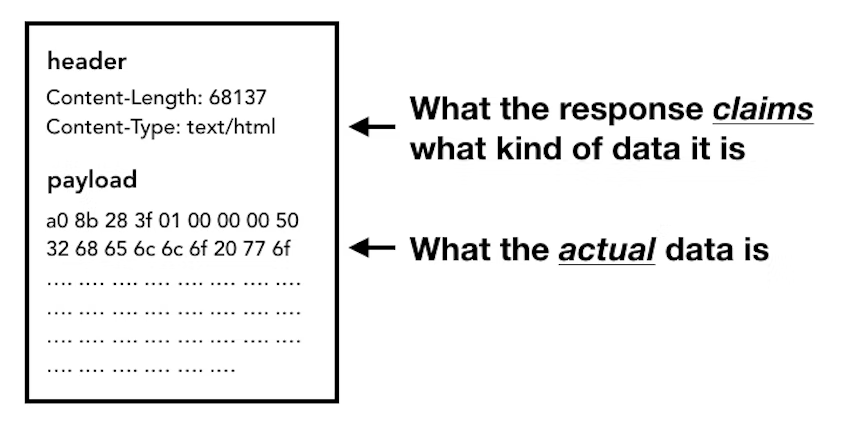​

如果响应的主体是一个 HTML 文件，浏览器会将获取的响应数据交给渲染进程（renderer process）来进行下一步的工作。如果拿到的响应数据是一个压缩文件（zip file）或者其他类型的文件，响应数据就会交给下载管理器（download manager）来处理。

​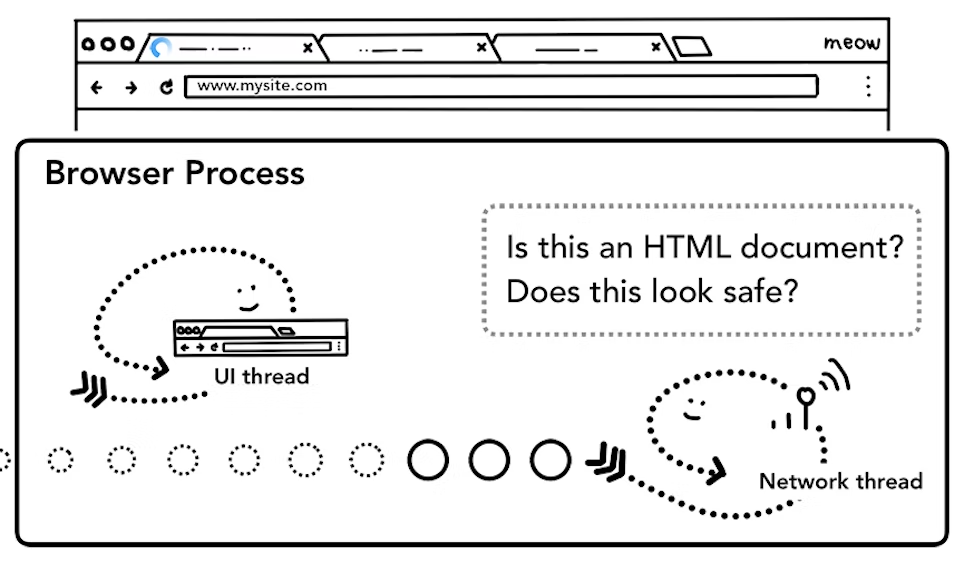​

网络线程在把内容交给渲染进程之前还会对内容做 [SafeBrowsing](https://safebrowsing.google.com/ "SafeBrowsing") 检查。如果请求的域名或者响应的内容和某个已知的病毒网站相匹配，网络线程会给用户展示一个警告的页面。除此之外，网络线程还会做 [CORB](https://www.chromium.org/Home/chromium-security/corb-for-developers/ "CORB")（**C**ross **O**rigin **R**ead **B**locking）检查来确定那些敏感的跨站数据不会被发送至渲染进程。

#### 4. 查找渲染进程

在网络线程做完所有的检查后并且能够确定浏览器应该导航到该请求的站点，它就会告诉 UI 线程所有的数据都已经被准备好了。UI 线程在收到网络线程的确认后会为这个网站寻找一个渲染进程（renderer process）来渲染界面。

​

由于网络请求可能需要长达几百毫秒的时间才能完成，为了缩短导航需要的时间，浏览器会在之前的一些步骤里面做一些优化。例如在第二步中当 UI 线程发送 URL 链接给网络线程后，它其实已经知晓它们要被导航到哪个站点了，所以在网络线程干活的时候，UI 线程会主动地为这个网络请求启动一个渲染线程。如果一切顺利的话（没有重定向之类的东西出现），网络线程准备好数据后页面的渲染进程已经就准备好了，这就节省了新建渲染进程的时间。不过如果发生诸如网站被重定向到不同站点的情况，刚刚那个渲染进程就不能被使用了，它会被摒弃，一个新的渲染进程会被启动。

#### 5. 提交导航

到这一步的时候，数据和渲染进程都已经准备好了，浏览器进程（browser process）会通过 IPC 告诉渲染进程去提交本次导航（commit navigation）。除此之外浏览器进程还会将刚刚接收到的响应数据流传递给对应的渲染进程让它继续接收到来的 HTML 数据。一旦浏览器进程收到渲染线程的回复说导航已经被提交了（commit），导航这个过程就结束了，文档的加载阶段（document loading phase）会正式开始。

这时导航栏会被更新，安全指示符（security indicator）和站点设置 UI（site settings UI）会展示新页面相关的站点信息。当前 tab 的会话历史（session history）也会被更新，这样当点击浏览器的前进和后退按钮也可以导航到刚刚导航完的页面。为了方便在关闭了 tab 或窗口（window）的时候还可以恢复当前 tab 和会话（session）内容，当前的会话历史会被保存在磁盘上面。

​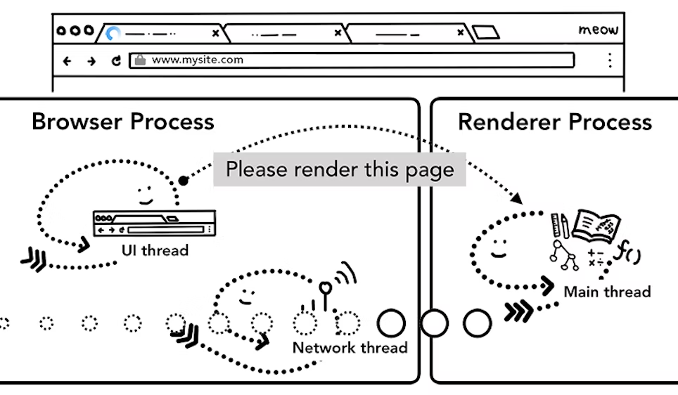​

#### 额外步骤：初始加载完成（Initial load complete）

当导航提交完成后，渲染进程开始着手加载资源以及渲染页面。一旦渲染进程“完成”（finished）渲染，它会通过 IPC 告知浏览器进程（注意这发生在页面上所有帧（frames）的 **onload** 事件都已经被触发了而且对应的处理函数已经执行完成了的时候），然后 UI 线程就会停止导航栏上旋转的圈圈。

我这里用到“完成”这个词，因为后面客户端的 JavaScript 还是可以继续加载资源和改变视图内容的。

​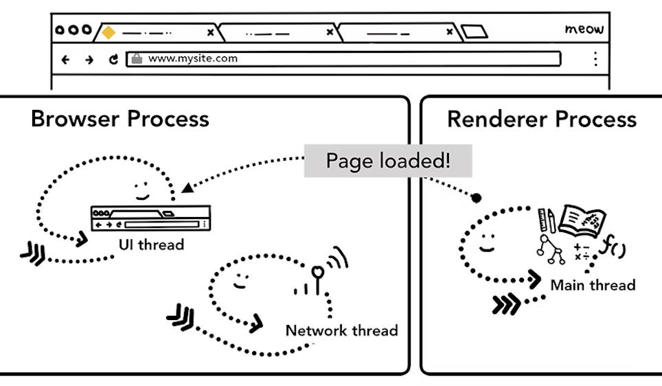​

### 导航到不同的站点

如果这时用户在导航栏上输入一个不一样的 URL 会发生什么呢？如果是这样，浏览器进程会重新执行一遍之前的那几个步骤来完成新站点的导航。不过在浏览器进程做这些事情之前，它需要让当前的渲染页面做一些收尾工作，具体就是询问一下当前的渲染进程需不需要处理一下[**beforeunload**](https://link.juejin.cn?target=https%3A%2F%2Fdeveloper.mozilla.org%2Fen-US%2Fdocs%2FWeb%2FEvents%2Fbeforeunload "https://developer.mozilla.org/en-US/docs/Web/Events/beforeunload")事件。

**beforeunload**可以在用户重新导航或者关闭当前 tab 时给用户展示一个“确定要离开当前页面吗？”的二次确认弹框。浏览器进程之所以要在重新导航的时候和当前渲染进程确认的原因是，当前页面发生的一切（包括页面的 JavaScript 执行）是不受它控制而是受渲染进程控制，所以它也不知道里面的具体情况。

**注意：不要随便给页面添加 beforeunload 事件监听，**定义的监听函数会在页面被重新导航的时候执行，因此这会增加重导航的时延。beforeunload 事件监听函数只有在十分必要的时候才能被添加，例如用户在页面上输入了数据，并且这些数据会随着页面消失而消失。

​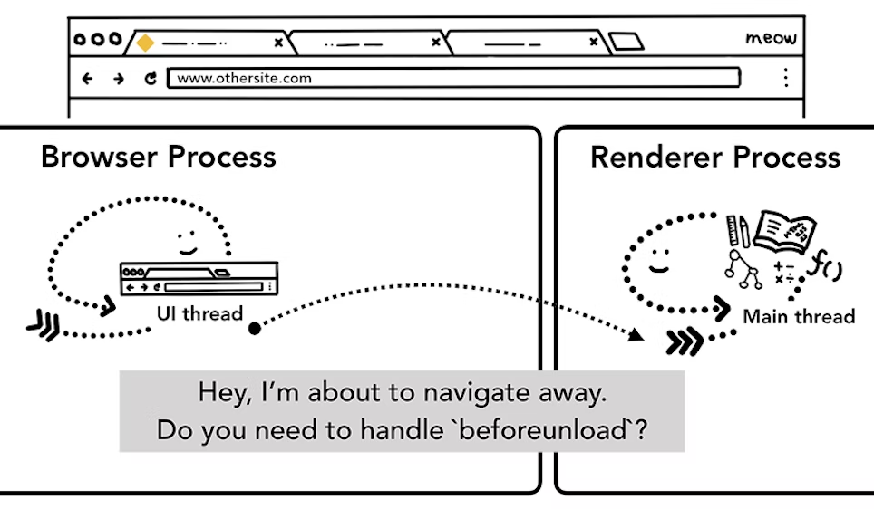​

如果重新导航是在页面内被发起的呢？例如用户点击了页面的一个链接或者客户端的 JavaScript 代码执行了诸如**window.location = &quot;**​\***\*​**&quot;**的代码。这种情况下，渲染进程会自己先检查一个它有没有注册**beforeunload\*\*事件的监听函数，如果有的话就执行，执行完后发生的事情就和之前的情况没什么区别了，唯一的不同就是这次的导航请求是由渲染进程给浏览器进程发起的。

如果是重新导航到不同站点（different site）的话，会有另外一个渲染进程被启动来完成这次重导航，而当前的渲染进程会继续处理现在页面的一些收尾工作，例如**unload**事件的监听函数执行。[Overview of page lifecycle states](https://developer.chrome.com/blog/page-lifecycle-api/#overview_of_page_lifecycle_states_and_events "Overview of page lifecycle states")这篇文章会介绍页面所有的生命周期状态，[the Page Lifecycle API](https://developer.chrome.com/blog/page-lifecycle-api/ "https://developers.google.com/web/updates/2018/07/page-lifecycle-api")会教如何在页面中监听页面状态的变化。

​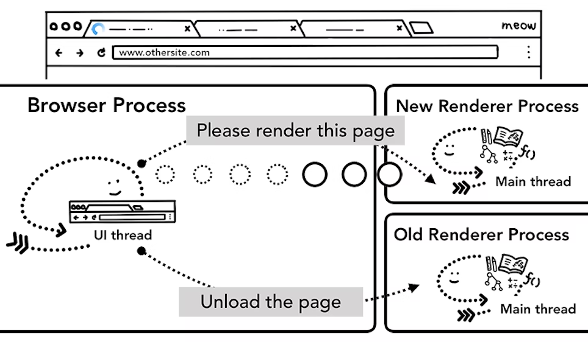

### Service Worker 的情景

这个导航过程最近发生的一个改变是引进了[service worker](https://developer.chrome.com/docs/workbox/service-worker-overview/ "https://developers.google.com/web/fundamentals/primers/service-workers/")的概念。因为 Service worker 可以用来写网站的网络代理（network proxy），所以开发者可以对网络请求有更多的控制权，例如决定哪些数据缓存在本地以及哪些数据需要从网络上面重新获取等等。如果开发者在 service worker 里设置了当前的页面内容从缓存里面获取，当前页面的渲染就不需要重新发送网络请求了，这就大大加快了整个导航的过程。

这里要重点留意的是 service worker 其实只是一些跑在渲染进程里面的 JavaScript 代码。那么问题来了，当导航开始的时候，浏览器进程是如何判断要导航的站点存不存在对应的 service worker 并启动一个渲染进程去执行它的呢？

其实 service worker 在注册的时候，它的作用范围（scope）会被记录下来（可以通过文章[The Service Worker Lifecycle](https://web.dev/service-worker-lifecycle/ "https://developers.google.com/web/fundamentals/primers/service-workers/lifecycle")了解更多关于 service worker 作用范围的信息）。在导航开始的时候，网络线程会根据请求的域名在已经注册的 service worker 作用范围里面寻找有没有对应的 service worker。如果有命中该 URL 的 service worker，UI 线程就会为这个 service worker 启动一个渲染进程（renderer process）来执行它的代码。Service worker 既可能使用之前缓存的数据也可能发起新的网络请求。

​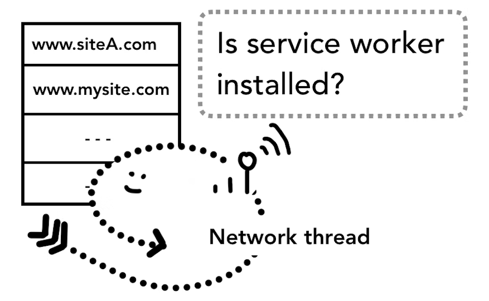​

​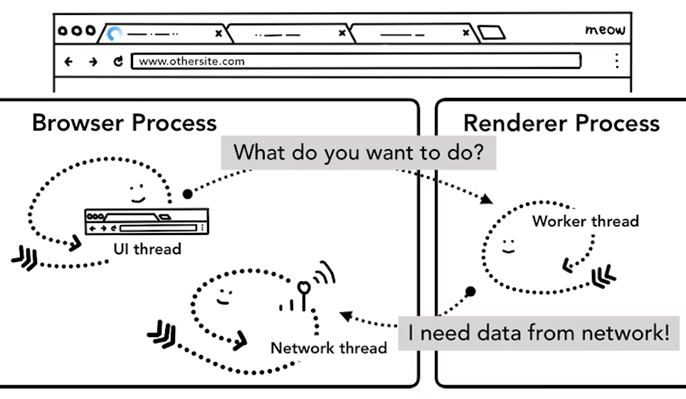​

### 导航预加载- Navigation Preload

在上面的例子中，应该可以感受到如果启动的 service worker 最后还是决定发送网络请求的话，浏览器进程和渲染进程这一来一回的通信包括 service worker 启动的时间其实增加了页面导航的时延。[导航预加载](https://web.dev/navigation-preload/ "https://developers.google.com/web/updates/2017/02/navigation-preload")就是一种通过在 service worker 启动的时候并行加载对应资源的方式来加快整个导航过程效率的技术。预加载资源的请求头会有一些特殊的标志来让服务器决定是发送全新的内容给客户端还是只发送更新了的数据给客户端。

​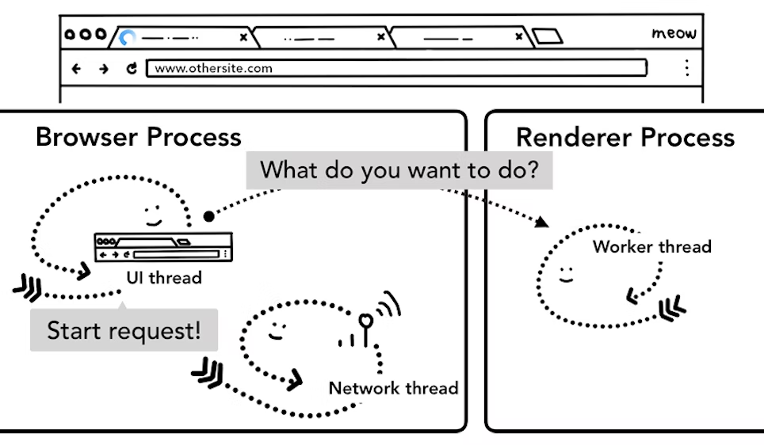​

## Part3

### 渲染进程处理页面内容

渲染进程负责标签（tab）内发生的所有事情。在渲染进程里面，主线程（main thread）处理了绝大多数你发送给用户的代码。如果你使用了 web worker 或者 service worker，相关的代码将会由工作线程（worker thread）处理。合成（compositor）以及光栅（raster）线程运行在渲染进程里面用来高效流畅地渲染出页面内容。

**渲染进程的主要任务是将 HTML，CSS，以及 JavaScript 转变为我们可以进程交互的网页内容**。

​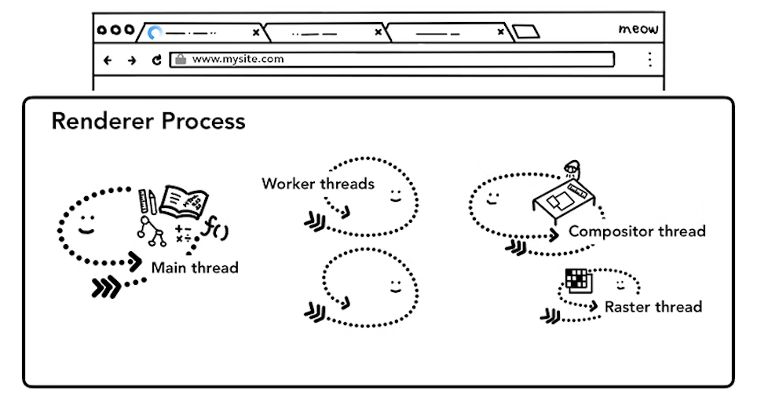​

### 解析

前面文章提到，渲染进程在导航结束的时候会收到来自浏览器进程提交导航（commit navigation）的消息，在这之后渲染进程就会开始接收 HTML 数据，同时主线程也会开始解析接收到的文本数据（text string）并把它转化为一个 DOM（**D**ocument **O**bject **M**odel）对象

**DOM 对象既是浏览器对当前页面的内部表示，也是 Web 开发人员通过 JavaScript 与网页进行交互的数据结构以及 API**。

如何将 HTML 文档解析为 DOM 对象是在[HTML 标准](https://link.juejin.cn?target=https%3A%2F%2Fhtml.spec.whatwg.org%2F "https://html.spec.whatwg.org/")中定义的。不过在你的 web 开发生涯中，你可能从来没有遇到过浏览器在解析 HTML 的时候发生错误的情景。**这是因为浏览器对 HTML 的错误容忍度很大**。举些例子：如果一个段落缺失了闭合 p 标签（</p>），这个页面还是会被当做为有效的 HTML 来处理；Hi! <b>I'm <i>Chrome</b>!</i> (闭合 b 标签写在了闭合 i 标签的前面) ，虽然有语法错误，不过浏览器会把它处理为 Hi! <b>I'm <i>Chrome</i></b><i>!</i>。如果你想知道浏览器是如何对这些错误进行容错处理的，可以参考 HTML 规范里面的[An introduction to error handling and strange cases in the parser](https://html.spec.whatwg.org/multipage/parsing.html#an-introduction-to-error-handling-and-strange-cases-in-the-parser "https://html.spec.whatwg.org/multipage/parsing.html#an-introduction-to-error-handling-and-strange-cases-in-the-parser")内容。

### 子资源加载

除了 HTML 文件，网站通常还会使用到一些诸如图片，CSS 样式以及 JavaScript 脚本等子资源。这些文件会从缓存或者网络上获取。主线程会按照在构建 DOM 树时遇到各个资源的循序一个接着一个地发起网络请求，可是为了提升效率，浏览器会同时运行“预加载扫描”（preload scanner）程序。如果在 HTML 文档里面存在诸如或者<link>这样的标签，预加载扫描程序会在 HTML 解析器生成的 token 里面找到对应要获取的资源，并把这些要获取的资源告诉浏览器进程里面的网络线程。

​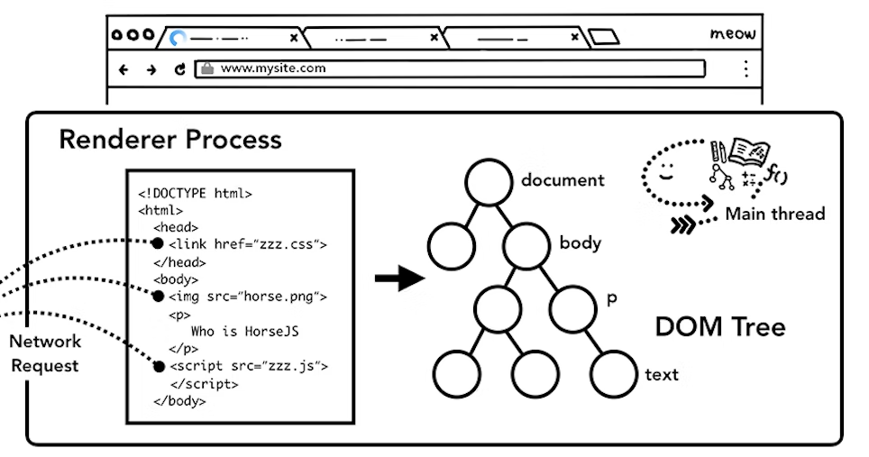​

### JavaScript 会阻塞 HTML 的解析过程

当 HTML 解析器碰到 script 标签的时候，它会停止 HTML 文档的解析从而转向 JavaScript 代码的加载，解析以及执行。为什么要这样做呢？因为 script 标签中的 JavaScript 可能会使用诸如`document.write()`​​ 这样的代码改变文档流（document）的形状，从而使整个 DOM 树的结构发生根本性的改变（HTML 规范里面的[overview of the parsing model 部分](https://html.spec.whatwg.org/multipage/parsing.html#overview-of-the-parsing-model "https://html.spec.whatwg.org/multipage/parsing.html#overview-of-the-parsing-model")有很好的示意图）。因为这个原因，HTML 解析器不得不等 JavaScript 执行完成之后才能继续对 HTML 文档流的解析工作。如果你想知道 JavaScipt 的执行过程都发生了什么，V8 团队有很多关于这个话题的[讨论](https://mathiasbynens.be/notes/shapes-ics "https://mathiasbynens.be/notes/shapes-ics")。

### 给浏览器一点如何加载资源的提示

Web 开发者可以通过很多方式告诉浏览器如何才能更加优雅地加载网页需要用到的资源。如果你的 JavaScript 不会使用到诸如`document.write()`​​​ 的方式去改变文档流的内容的话，你可以为 script 标签添加一个[async](https://developer.mozilla.org/en-US/docs/Web/HTML/Element/script#attr-async "https://developer.mozilla.org/en-US/docs/Web/HTML/Element/script#attr-async")或者[defer](https://developer.mozilla.org/en-US/docs/Web/HTML/Element/script#attr-defer "https://developer.mozilla.org/en-US/docs/Web/HTML/Element/script#attr-defer")属性来使 JavaScript 脚本进行异步加载。当然如果能满足到你的需求，你也可以使用[JavaScript Module](https://v8.dev/features/modules "https://developers.google.com/web/fundamentals/primers/modules")。

同时`<link rel="preload">`​​ 资源预加载可以用来告诉浏览器这个资源在当前的导航肯定会被用到，你想要尽快加载这个资源。更多相关的内容，你可阅读[Resource Prioritization - Getting the Browser to Help You](https://web.dev/fast/#prioritize-resources "https://developers.google.com/web/fundamentals/performance/resource-prioritization")这篇文章。

### 样式计算-Style calculation

拥有了 DOM 树我们还不足以知道页面的外貌，因为我们通常会为页面的元素设置一些样式。主线程会解析页面的 CSS 从而确定每个 DOM 节点的计算样式（computed style）。计算样式是主线程根据 CSS 样式选择器（CSS selectors）计算出的每个 DOM 元素应该具备的具体样式，你可以打开 devtools 来查看每个 DOM 节点对应的计算样式。

​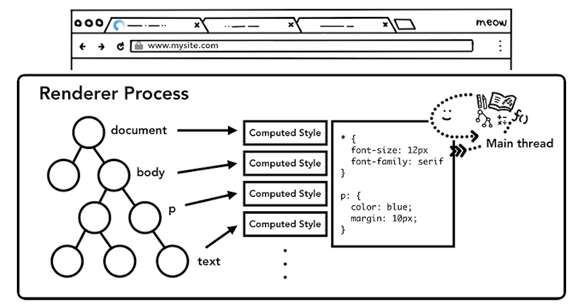​

即使你的页面没有设置任何自定义的样式，每个 DOM 节点还是会有一个计算样式属性，这是因为每个浏览器都有自己的默认样式表。因为这个样式表的存在，页面上的 h1 标签一定会比 h2 标签大，而且不同的标签会有不同的 magin 和 padding。如果你想知道 Chrome 的默认样式是长什么样的，你可以直接查看[代码](https://source.chromium.org/chromium/chromium/src/+/main:third_party/blink/renderer/core/html/resources/html.css "https://cs.chromium.org/chromium/src/third_party/blink/renderer/core/html/resources/html.css")。

### 布局-Layout

前面这些步骤完成之后，渲染进程就已经知道页面的具体文档结构以及每个节点拥有的样式信息了，可是这些信息还是不能最终确定页面的样子。举个例子，假如你现在想通过电话告诉你的朋友你身边的一幅画的内容：“画布上有一个红色的大圆圈和一个蓝色的正方形”，单凭这些信息你的朋友是很难知道这幅画具体是什么样子的，因为他不知道大圆圈和正方形具体在页面的什么位置，是正方形在圆圈前面呢还是圆圈在正方形的前面。

渲染网页也是同样的道理，只知道网站的文档流以及每个节点的样式是远远不足以渲染出页面内容的，还需要通过布局（layout）来计算出每个节点的**几何信息**（geometry）。布局的具体过程是：主线程会遍历刚刚构建的 DOM 树，根据 DOM 节点的计算样式计算出一个布局树（layout tree）。布局树上每个节点会有它在页面上的 x，y 坐标以及盒子大小（bounding box sizes）的具体信息。布局树长得和先前构建的 DOM 树差不多，不同的是这颗树只有那些可见的（visible）节点信息。举个例子，如果一个节点被设置为了**display:none**，这个节点就是不可见的就不会出现在布局树上面（**visibility:hidden**的节点会出现在布局树上面，你可以思考一下这是为什么）。同样的，如果一个伪元素（pseudo class）节点有诸如`p::before{content:"Hi!"}`​ 这样的内容，它会出现在布局上，而不存在于 DOM 树上。

​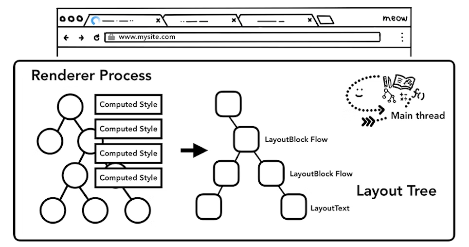​

即使页面的布局十分简单，布局这个过程都是非常复杂的。例如页面就是简单地从上而下展示一个又一个段落，这个过程就很复杂，因为需要考虑段落中的字体大小以及段落在哪里需要进行换行之类的东西，它们都会影响到段落的大小以及形状，继而影响到接下来段落的布局。

如果考虑到 CSS 的话将会更加复杂，因为 CSS 是一个很强大的东西，它可以让元素悬浮（float）到页面的某一边，还可以遮挡住页面溢出的（overflow）元素，还可以改变内容的书写方向，所以单是想一下就知道布局这个过程是一个十分艰巨和复杂的任务。对于 Chrome 浏览器，有一整个负责布局过程的工程师团队。如果想知道他们工作的具体内容，他们在[BlinkOn Conference](https://www.youtube.com/watch?v=Y5Xa4H2wtVA "https://www.youtube.com/watch?v=Y5Xa4H2wtVA")上面的相关讨论被录制了下来。

### 画-Paint

知道了 DOM 节点以及它的样式和布局其实还是不足以渲染出页面来的。为什么呢？举个例子，假如你现在想对着一幅画画一幅一样的画，你已经知道了画布上每个元素的大小，形状以及位置，你还是得思考一下每个元素的绘画顺序，因为画布上的元素是会互相遮挡的（z-index）。

举个例子，如果页面上的某些元素设置了**z-index**属性，绘制元素的顺序就会影响到页面的正确性。

​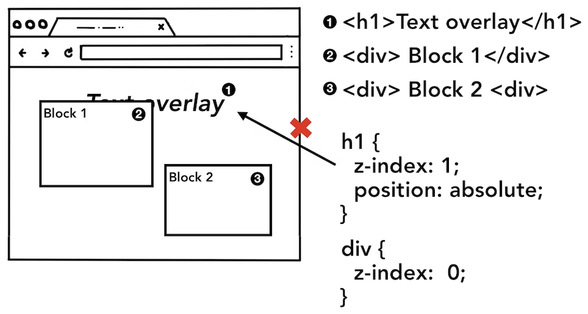​

在绘画这个步骤中，主线程会遍历之前的到的布局树（layout tree）来生成一系列的绘画记录（paint records）。绘画记录是对绘画过程的注释，例如“首先画背景，然后是文本，最后画矩形”。如果你曾经在 canvas 画布上有使用过 JavaScript 绘制元素，你可能会觉着这个过程不是很陌生。

​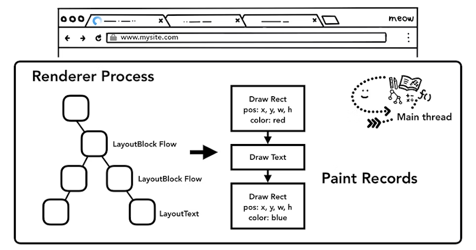​

### 高成本的**渲染管线**（rendering pipeline）更新

关于渲染管线有一个十分重要的点就是管线的每一步都要使用到前一步的结果来生成新的数据，这就意味着如果某一步的内容发生了改变的话，这一步后面所有的步骤都要被重新执行以生成新的记录。举个例子，如果布局树有些东西被改变了，文档上那些被影响到的部分的绘画顺序是要重新生成的。

<video controls="controls" src="./现代浏览器架构/d7zOpwpNIXIoVnoZCtI9-20230319160219-xxe6fk0.mp4" data-src="./现代浏览器架构/d7zOpwpNIXIoVnoZCtI9-20230319160219-xxe6fk0.mp4"></video>

如果你的页面元素有动画效果（animating），浏览器就不得不在每个渲染帧的间隔中通过渲染管线来更新页面的元素。我们大多数显示器的刷新频率是一秒钟 60 次（60fps），如果你在每个渲染帧的间隔都能通过管线移动元素，人眼就会看到流畅的动画效果。可是如果管线更新时间比较久，动画存在丢帧的状况的话，页面看起来就会很“卡顿”。

​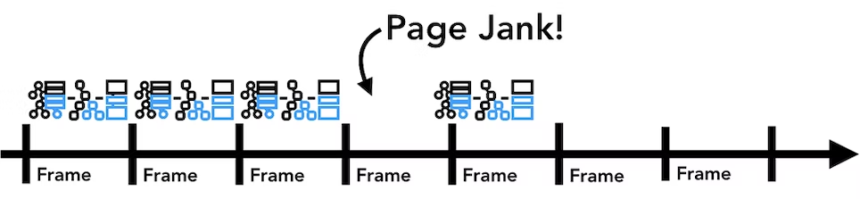​

即使您的渲染操作跟上屏幕刷新，这些计算也在主线程上运行，这意味着当您的应用程序运行 JavaScript 时它可能会被阻塞。

​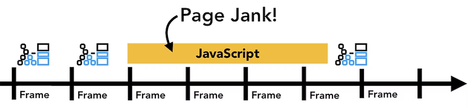​

对于这种情况，你可以将要被执行的 JavaScript 操作拆分为更小的块然后通过`requestAnimationFrame`​ 这个 API 把他们放在每个动画帧中执行。想知道更多关于这方面的信息的话，可以参考[Optimize JavaScript Execution](https://web.dev/optimize-javascript-execution/ "https://developers.google.com/web/fundamentals/performance/rendering/optimize-javascript-execution")。当然你还可以将 JavaScript 代码放在[WebWorkers](https://www.youtube.com/watch?v=X57mh8tKkgE "https://www.youtube.com/watch?v=X57mh8tKkgE")中执行来避免它们阻塞主线程。

​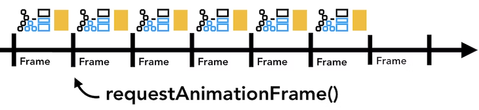​

### 合成

#### 如何绘制一个页面？

到目前为止，浏览器已经知道了关于页面以下的信息：文档结构，元素的样式，元素的几何信息以及它们的绘画顺序。那么浏览器是如何利用这些信息来绘制出页面来的呢？**将以上这些信息转化为显示器的像素的过程叫做光栅化（rasterizing）**。

可能一个最简单的做法就是只光栅化视口内（viewport）的网页内容。如果用户进行了页面滚动，就移动光栅帧（rastered frame）并且光栅化更多的内容以补上页面缺失的部分。Chrome 的第一个版本其实就是这样做的。然而，对于现代的浏览器来说，它们往往采取一种更加复杂的叫做合成（compositing）的做法。

<video controls="controls" src="./现代浏览器架构/AiIny83Lk4rTzsM8bxSn-20230319160944-s4624os.mp4" data-src="./现代浏览器架构/AiIny83Lk4rTzsM8bxSn-20230319160944-s4624os.mp4"></video>

#### 什么是合成？

合成是一种将页面分成若干层，然后分别对它们进行光栅化，最后在一个单独的线程 - 合成线程（compositor thread）里面合并成一个页面的技术。当用户滚动页面时，由于页面各个层都已经被光栅化了，浏览器需要做的只是合成一个新的帧来展示滚动后的效果罢了。页面的动画效果实现也是类似，将页面上的层进行移动并构建出一个新的帧即可。

你可以通过[Layers panel](https://blog.logrocket.com/eliminate-content-repaints-with-the-new-layers-panel-in-chrome-e2c306d4d752/?gi=cd6271834cea "https://blog.logrocket.com/eliminate-content-repaints-with-the-new-layers-panel-in-chrome-e2c306d4d752?gi=cd6271834cea")在 DevTools 查看你的网站是如何被浏览器分成不同的层的。

<video controls="controls" src="./现代浏览器架构/Aggd8YLFPckZrBjEj74H-20230319161204-jvnh77i.mp4" data-src="./现代浏览器架构/Aggd8YLFPckZrBjEj74H-20230319161204-jvnh77i.mp4"></video>

#### 页面分层

为了确定哪些元素需要放置在哪一层，主线程需要遍历渲染树来创建一棵层次树（Layer Tree）（在 DevTools 中这一部分工作叫做“Update Layer Tree”）。如果页面的某些部分应该被放置在一个单独的层上面（滑动菜单）可是却没有的话，你可以通过使用`will-change`​ CSS 属性来告诉浏览器对其分层。

​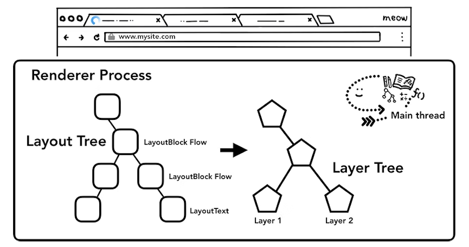​

你可能会想要给页面上所有的元素一个单独的层，然而当页面的层超过一定的数量后，层的合成操作要比在每个帧中光栅化页面的一小部分还要慢，因此衡量你应用的渲染性能是十分重要的一件事情。想要获取关于这方面的更多信息，可以参考文章[Stick to Compositor-Only Properties and Manage Layer Count](https://web.dev/stick-to-compositor-only-properties-and-manage-layer-count/ "https://developers.google.com/web/fundamentals/performance/rendering/stick-to-compositor-only-properties-and-manage-layer-count")。

#### 在主线程之外光栅化和合成页面

一旦页面的层次树创建出来并且页面元素的绘制顺序确定后，主线程就会向合成线程（compositor thread）提交这些信息。然后合成线程就会光栅化页面的每一层。因为页面的一层可能有整个网页那么大，所以合成线程需要将它们切分为一块又一块的小图块（tiles）然后将图块发送给一系列光栅线程（raster threads）。光栅线程会栅格化每个图块并且把它们存储在 GPU 的内存中。

​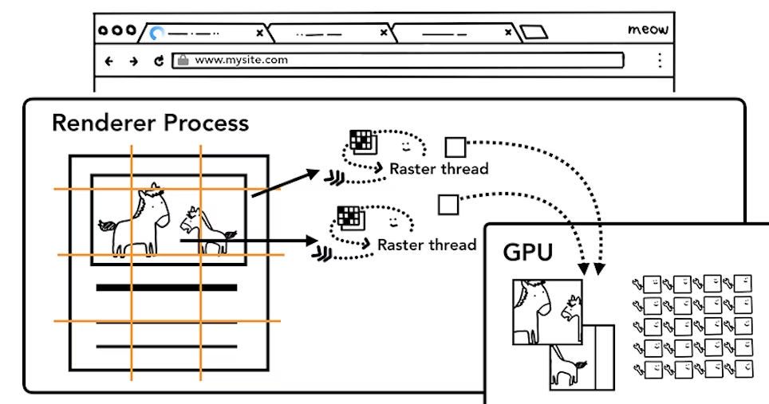​

合成线程可以给不同的光栅线程赋予不同的优先级（prioritize），进而使那些**在视口中的或者视口附近的页面可以先被光栅化**。为了响应用户对页面的放大和缩小操作，页面的图层（layer）会为不同的清晰度配备不同的图块。

当图层上面的图块都被栅格化后，合成线程会收集图块上面叫做**绘画四边形**（draw quads）的信息来构建一个**合成帧**（compositor frame）。

- 绘画四边形：包含图块在**内存的位置**以及图层合成后图块在页面的位置之类的信息。
- 合成帧：代表页面一个帧的内容的绘制四边形**集合**。

上面的步骤完成之后，合成线程就会通过 IPC 向浏览器进程（browser process）提交（commit）一个渲染帧。这个时候可能有另外一个合成帧被浏览器进程的 UI 线程（UI thread）提交以改变浏览器的 UI。这些合成帧都会被发送给 GPU 从而展示在屏幕上。如果合成线程收到页面滚动的事件，合成线程会构建另外一个合成帧发送给 GPU 来更新页面。

​​

合成的好处在于这个过程没有涉及到主线程，所以合成线程不需要等待样式的计算以及 JavaScript 完成执行。这也就是为什么说[只通过合成来构建页面动画](https://web.dev/animations-guide/ "https://www.html5rocks.com/en/tutorials/speed/high-performance-animations/")是构建流畅用户体验的最佳实践的原因了。如果页面需要被重新布局或者绘制的话，主线程一定会参与进来的。

### 从浏览器的角度来看输入事件

当你听到“输入事件”（input events）的时候，你可能只会想到用户在文本框中输入内容或者对页面进行了点击操作，可是从浏览器的角度来看的话，输入其实代表着来自于用户的任何手势动作（gesture）。所以用户`滚动页面`​，`触碰屏幕`​ 以及`移动鼠标`​ 等操作都可以看作来自于用户的输入事件。

当用户做了一些诸如触碰屏幕的手势动作时，浏览器进程（browser process）是第一个可以接收到这个事件的地方。可是浏览器进程只能知道用户的手势动作发生在什么地方而不知道如何处理，这是因为标签内（tab）的内容是由页面的渲染进程（render process）负责的。因此浏览器进程会将事件的类型（如`touchstart`​）以及坐标（coordinates）发送给渲染进程。为了可以正确地处理这个事件，渲染进程会找到事件的目标对象（target）然后运行这个事件绑定的监听函数（listener）。

​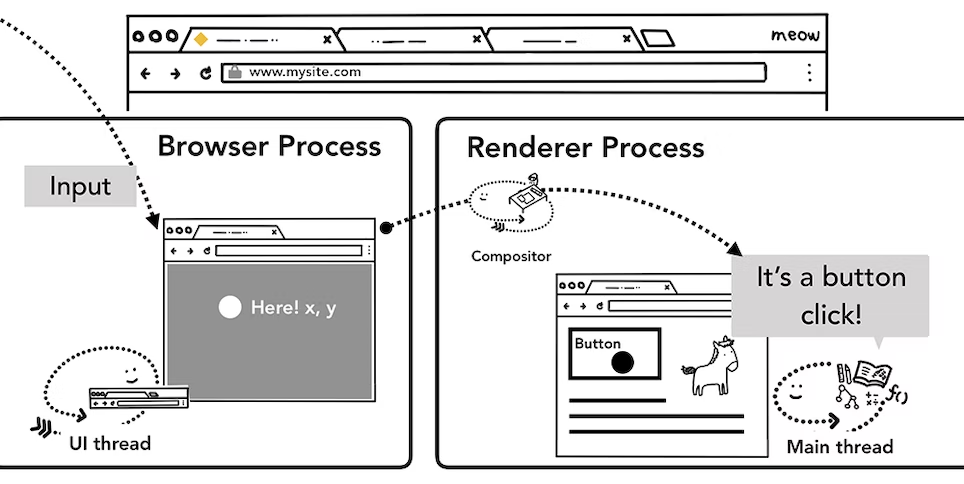​

### 合成线程接收到输入事件

如果当前页面不存在任何用户事件的监听器（event listener），合成线程完全不需要主线程的参与就能创建一个新的合成帧来响应事件。可是如果页面有一些事件监听器（event listeners）呢？合成线程是如何判断出这个事件是否需要路由给主线程处理的呢？

### 理解非快速滚动区域 - non-fast scrollable region

因为页面的 JavaScript 脚本是在主线程（main thread）中运行的，所以当一个页面被合成的时候，合成线程会将页面那些注册了事件监听器的区域标记为“非快速滚动区域”（Non-fast Scrollable Region）。由于知道了这些信息，当用户事件发生在这些区域时，合成线程会将输入事件发送给主线程来处理。如果输入事件不是发生在非快速滚动区域，合成线程就无须主线程的参与来合成一个新的帧。

​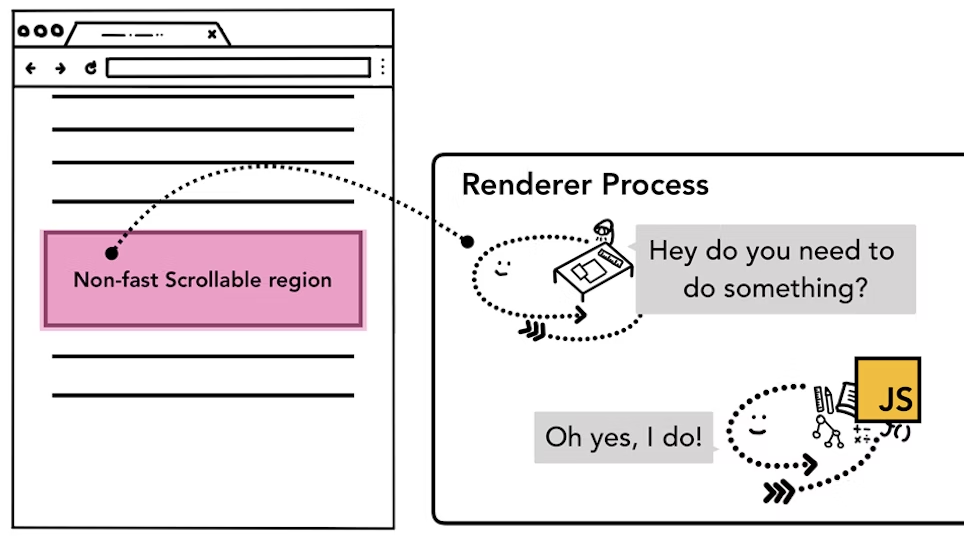​

### 编写事件处理程序时要注意

Web 开发的一个常见的模式是事件委托（event delegation）。由于事件会冒泡，你可以给顶层的元素绑定一个事件监听函数来作为其所有子元素的事件委托者，这样子节点的事件就可以统一被顶层的元素处理了。因此你可能看过或者写过类似于下面的代码：

```javascript
document.body.addEventListener("touchstart", (event) => {
  if (event.target === area) {
    event.preventDefault();
  }
});
```

只用一个事件监听器就可以服务到所有的元素，乍一看这种写法还是挺实惠的。可是，如果你从浏览器的角度去看一下这段代码，你会发现上面给 body 元素绑定了事件监听器后其实是将整个页面都标记为一个非快速滚动区域，这就意味着即使你页面的某些区域压根就不在乎是不是有用户输入，当用户输入事件发生时，合成线程每次都会告知主线程并且会等待主线程处理完它才干活。因此这种情况下合成线程就丧失提供流畅用户体验的能力了（smooth scrolling ability）。

​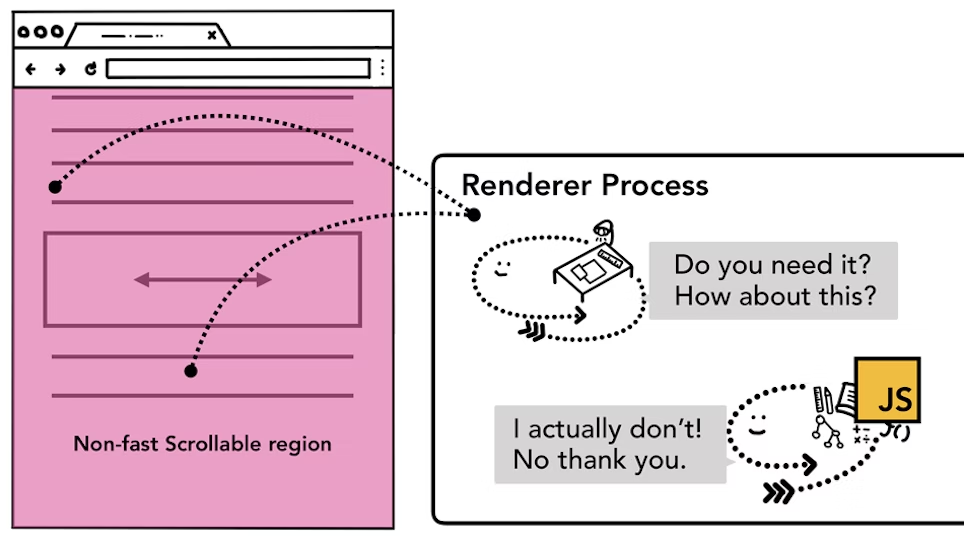​

为了减轻这种情况的发生，您可以为事件监听器传递`passive：true`​ 选项。 这个选项会告诉浏览器您仍要在主线程中侦听事件，可是合成线程也可以继续合成新的帧。

```javascript
document.body.addEventListener(
  "touchstart",
  (event) => {
    if (event.target === area) {
      event.preventDefault();
    }
  },
  { passive: true }
);
```

### 检查事件是否可取消

假设您在页面中有一个框，您希望将滚动方向限制为仅水平滚动。

在您的指针事件中使用`passive: true`​ 选项意味着页面滚动可以平滑，但垂直滚动可能已经在您想要的时间开始，`preventDefault`​ 以限制滚动方向。您可以使用方法对此进行检查`event.cancelable`​。

​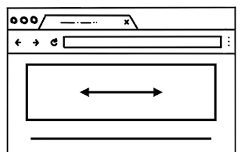​

```javascript
document.body.addEventListener(
  "pointermove",
  (event) => {
    if (event.cancelable) {
      event.preventDefault(); // block the native scroll
      /*
       *  do what you want the application to do here
       */
    }
  },
  { passive: true }
);
```

或者，您可以使用 CSS 规则来`touch-action`​ 完全消除事件处理程序。

```css
#area {
  touch-action: pan-x;
}
```

### 查找事件的目标对象（event target）

当合成线程向主线程发送输入事件时，主线程要做的第一件事是通过命中测试（hit test）去找到事件的目标对象（target）。具体的命中测试流程是遍历在渲染流水线中生成的绘画记录（paint records）来找到输入事件出现的 x, y 坐标上面描绘的对象是哪个。

Hit test：[判断用户的鼠标或触摸点是否与页面上的某个元素相交的过程。它是一种消耗性能的操作，因为浏览器需要遍历页面上的所有元素，从最顶层开始，找到与用户输入点重叠的元素](https://juejin.cn/post/7204998680066883642)​[^1^](https://juejin.cn/post/7204998680066883642)。

​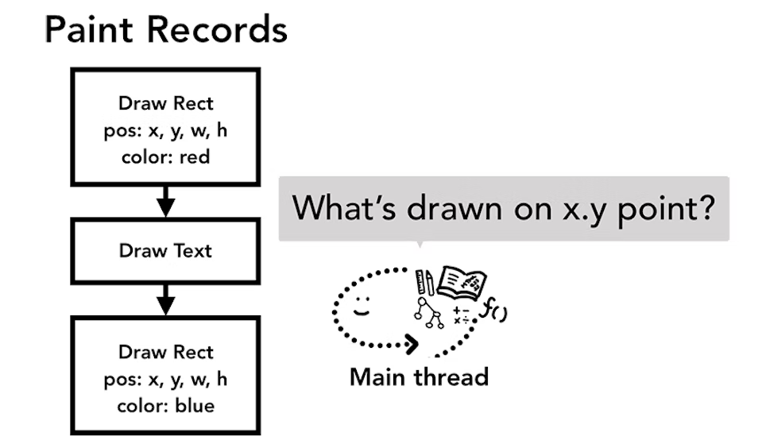​

### 最小化发送给主线程的事件数

对于用户输入来说，触摸屏一般一秒钟会触发 60 到 120 次点击事件，而鼠标一般则会每秒触发 100 次事件，因此输入事件的触发频率其实远远高于我们屏幕的刷新频率。

如果每秒将诸如`touchmove`​ 这种连续被触发的事件发送到主线程 120 次，因为屏幕的刷新速度相对来说比较慢，它可能会触发过量的命中测试以及 JavaScript 代码的执行。

​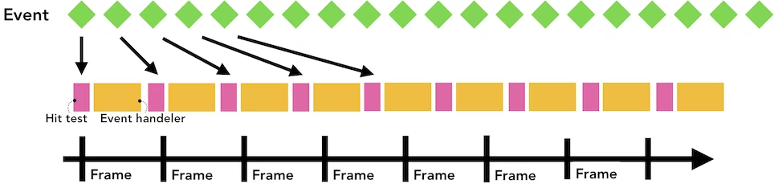​

为了最大程度地减少对主线程的过多调用，Chrome 会合并连续事件（例如`wheel`​，`mousewheel`​，`mousemove`​，`pointermove`​，`touchmove`​），并将调度延迟到下一个`requestAnimationFrame`​ 之前。

​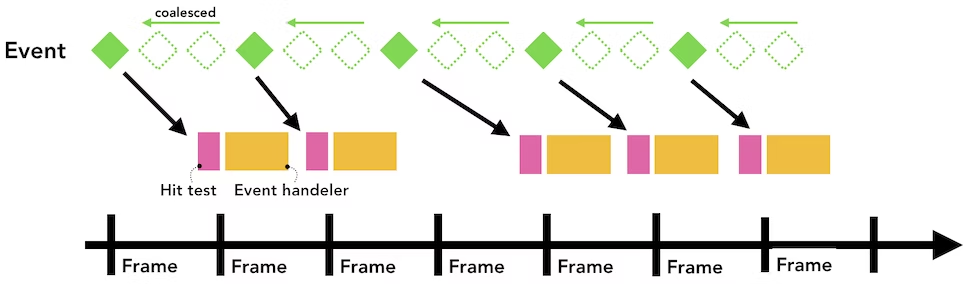​

任何诸如`keydown`​，`keyup`​，`mouseup`​，`mousedown`​，`touchstart`​ 和`touchend`​ 等相对不怎么频繁发生的事件都会被立即派送给主线程。

### 使用 getCoalesecedEvents 来获取帧内（intra-frame）事件

对于大多数 web 应用来说，合并事件应该已经足够用来提供很好的用户体验了，然而，如果你正在构建的是一个根据用户的`touchmove`​ 坐标来进行绘图的应用的话，合并事件可能会使页面画的线不够顺畅和连续。在这种情况下，你可以使用鼠标事件的`getCoalescedEvents`​ 来获取被合成的事件的详细信息。

​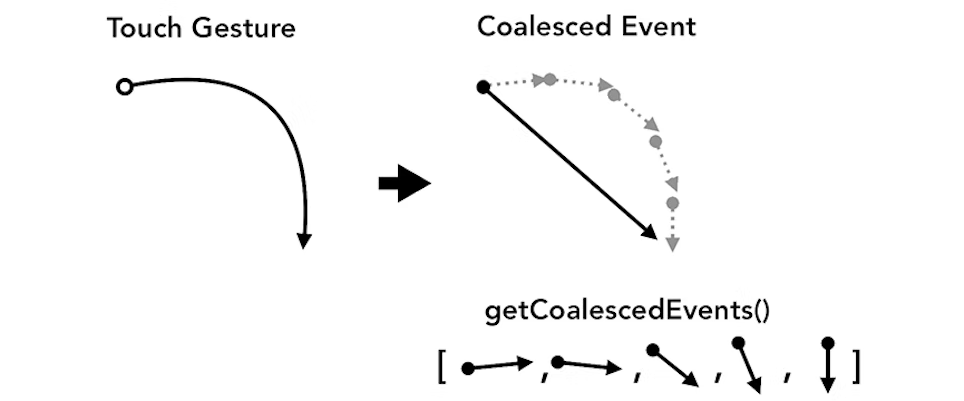​

```css
window.addEventListener('pointermove', event => {
    const events = event.getCoalescedEvents();
    for (let event of events) {
        const x = event.pageX;
        const y = event.pageY;
        // draw a line using x and y coordinates.
    }
});
```

# done！
